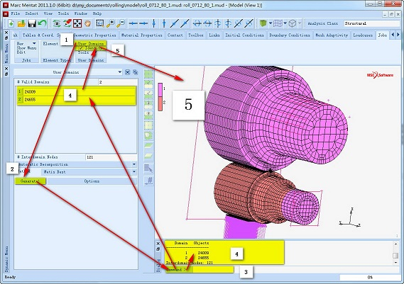
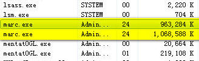

# MSC-Marc 2011单机多核并行计算示例

---

并行计算可以有效利用本地或者网络计算机资源，提高计算效率，特别是针对一些计算规模较大的问题。本文示例Marc单机多核并行计算。

测试平台：WIN7 64Bit MARC2011

## 开启并行计算

以 **管理员权限** 执行以下步骤：

1. 在MARC安装路径下`/intel/mpi/win64/bin`文件夹（32Bit计算机选择`win32`文件夹），运行`wmpiregister.exe`。

2. 输入Windows登录用户名(通常为administrator)及密码（若密码为空，需要重新设置一个密码），点击`register`按钮。出现如下信息表示这一步顺利完成：

        Password encrypted into the Registry

3. 运行`ismpd.exe`，或者在命令行运行`ismpd -install`。

## 分配计算单元

单机多核计算提高效率的途径在于几个核心同时进行计算，因此对一个模型完成所有的建模后需要为参与计算的多核分配计算任务（软件自动分配或者用户手动分配），也就是单元，最后在提交任务前提示软件进行并行计算。

!!! warning

    并行计算并非适用于任何分析场合，例如设置了全局网格自适应划分，则不支持并行计算。

测试电脑为双核4线程，这里设置2核计算。

### 自动分配单元

* ① `Jobs` -> `User Domains`调出面板
* ② `Generate!`按钮设置参与计算的CPU内核数
* ③ 输入分配的内核数2，回车确定
* ④ 软件自动为两个内核分配单元，并输出单元数信息
* ⑤ 勾选`Identify`，显示单元分配情况

### 手动分配单元

* ① 选择`Manul Decomposition`，出现手动分配单元的一些命令按钮
* ② `Delete All`删除之前自动分配情况
* ③ `Add Elements`分别为内核分配不同的单元

## 提交计算

完成上述步骤后，勾选`Parallelization`选项即可进行并行计算：

* ① `Job—>Show Menu`进入`Job`面板
* ② `Run`命令进入`Run Job`面板
* ③ 点击`Parallelization`进入相应面板
* ④ 勾选`Use DDM`选项，假如使用用户分配的单元，选择`Decomposition In Mentat`
* ⑤ 点击OK回到`Run Job`面板
* ⑥ 点击`Submit`提交任务进行并行计算

运行情况如下图所示：

