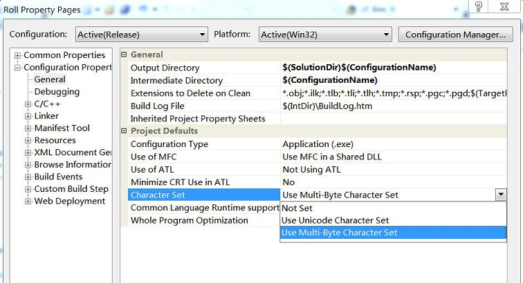

# 实例说明VS2005、Python程序读写文件时的字符编码问题

2012-10-10

---

根据项目需求，需要以文本文件的方式实现MFC程序与Marc程序之间的数据交换，现将其简化为：通过MFC程序选择一个目标路径并另存为文本文件temp.txt，然后在Mentat中调用python脚本读取该路径，实现在该路径下保存Marc模型文件test.mud。

## MFC写文件

通过以下代码将文件对话框获取的路径写入`C:\temp.txt`：

```cpp
CFile file(_T("C:\\temp.txt"), CFile::modeWrite|CFile::modeCreate|CFile::typeBinary);
CString str = dlg->workPath;
file.Write(str, str.GetLength());
file.Close();
```

但是，使用记事本打开`C:\temp.txt`发现存在两个问题：

* 路径不完整——表明写入的字符数不正确

* 中文路径出现乱码——表明存在编码错误。

这是因为VS2005默认为Unicode编码，根据Unicode编码规则，`GetLength()`获得长度实际为CString的一半，于是出现路径不完整的错误；而记事本默认为ANSI编码格式，于是出现乱码。

相应对策为：

* 人为地，将写入字符数乘以2

        file.Write(str, 2*str.GetLength())

* 采用Unicode的解码格式。实际上已经采用Unicode格式存储，显示乱码与否只是编辑器解码的问题，不影响程序数据交换。

改进后，在`Sublime Text`以`UTF-16 le`编码格式打开`C:\temp.txt`，发现一切正常。

## Python读文件

通过以下代码读取`C:\temp.txt`中的目标路径：

```python
from py_mentat import *
import codecs

# main function
def main():
    f = codecs.open("C:\\temp.txt","rb")
    s = f.readline()
    x = s + "\\test.mud"
    print s # output test
    py_send("*save_as_model " + x + " yes")
```

可是，在Mentat中调用python脚本报错，观察`print s`的结果发现目标路径的输出是乱码。联想到此前`temp.txt`文件为`Unicode 16 le`编码格式，则应当以此种方式打开文件，于是修改为

```python
f = codecs.open("C:\\temp.txt", "rb", "utf_16_le")
```

这次目标位置显示正确，但是依旧存在错误[^1]：


    UnicodeEncodeError: 'ascii' codec can't encode characters in position 31-34: ordinal not in range(128)

根据错误信息可知：变量`x`的类型为unicode，而`py_send("*save_as_model " + x +" yes")`处理的是str类型，这就存在一个编码过程——将unicode以某种规则编码为str。而默认的`ascii`编码格式不足以胜任。

解决方法为增加编码规则[^2] [^3] [^4]，由于需要处理中文编码，最好采用`gbk`编码方式，相应语句改为：

```python
x = s.encode("gbk") + '\\test.mud'
```

至此完全实现预期结果。


## 更好的方案

经历以上过程想必对字符编码、解码问题有所体会了。回到源头，问题的根源在于VS2005默认采用的`unicode`编码方式。实际上，我们可以自行修改其编码方式为 **多字节字符集（multi-byte character）**[^5] [^6]，这样以`ANSI`编码方式保存文件。




如此一来，之前的问题不复存在：

* 可以直接采用`file.Write(str,str.GetLength())`写文件
* 用记事本打开时不会显示乱码
* Python可以按常规方式读写ANSI编码格式文件

```python
from py_mentat import *

# main function
def main():
    f = open("C:\\temp.txt","rb")
    s = f.readline()
    x = s + "\\test.mud"
    py_send("*save_as_model " + x + " yes")
```


[^1]: [python新手必碰到的问题---encode与decode，中文乱码[转]](http://www.51testing.com/?uid-524463-action-viewspace-itemid-817888)
[^2]: [python的str，unicode对象的encode和decode方法（转）](http://www.cnblogs.com/DxSoft/archive/2010/05/21/1741043.html)
[^3]: [[转]Python、Unicode和中文](http://www.blogjava.net/pts/archive/2008/02/25/182076.html)
[^4]: [Python字符集编码和文件读写](http://blog.csdn.net/lf8289/article/details/2465196)
[^5]: [转：Multi-Byte Character Set &amp; Use Unicode Character Set](http://blog.sina.com.cn/s/blog_78fd98af0100xlgq.html)
[^6]: [unicode character multi-byte character编码](http://blog.163.com/dujinhui1988@126/blog/static/14028002720114141012541/)