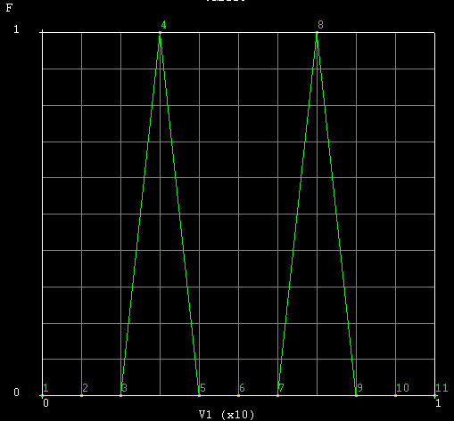

# MSC.MARC 2010刚性接触体运动设置

---

MARC中有三种方式设置刚性接触体的运动：速度控制、位移控制、力控制。结合这三种控制方式及表格功能，可以实现各种自定义运动。

## 速度控制

速度控制面板如下图所示。其中，平动和旋转都是全局坐标系下相对旋转中心（默认为坐标原点）的速度。

!!! note "注意："
    上图通过表格来控制y方向的平动速度。速度曲线体现为每个增量步内的位移，即速度曲线与坐标轴围成的面积。

假设每个增量步的时间为1s，y方向速度如上图所示，`table5`如下图所示，则第三增量步内刚体向y轴负方向运动了`0.1*(0.5*1*1)=0.05mm`，其他以此类推。

## 位移控制

参数输入面板与速度控制类似。平动和旋转都是全局坐标系下相对旋转中心（默认为坐标原点）的位置。

!!! note "注意："
    一个增量步内刚体平动的位移表现为位移曲线在增量步始末时刻的数值之差，即增量步时间内纵轴的数值。

假设上图为位移曲线，则第三增量步内位移为`-0.1*(1-0)=-0.1mm`，即沿着y轴负向运动了0.1mm。

## 力控制

力控制需要通过设置控制节点和辅助节点来完成，这两个节点必须是单元节点之外的节点。

- 控制节点表示刚体的三个平动自由度，可以在位移边界条件`FIXED DISPLACEMENT`中对此节点施加位移约束以实现预定的运动方式。同时控制节点作为刚体旋转的中心点（旋转轴根据需要自定义）。

- 辅助节点控制刚体的转动自由度，在边界条件`POINT LOAD`中对此节点施加扭矩来实现相应的转动。注意：FORCE X、Y、Z表示三个方向的扭矩，而非MOMENT X、Y、Z。

