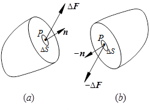
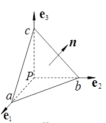
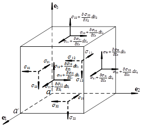

# 应力张量的认识：基本概念

---

从本科的材料成形原理教材上认识了应力张量后，它便一直出现在我们的视野里。初始，仅是一个基本定义接受了它，进而有过疑惑，随着矩阵论的学习又有了新的认识。曾经就有记录下对其理解的想法，但因思路尚未完善而一再搁置；直到今天重新想起，并完成了方向余弦作为线性空间的证明，才终于开始详细记录。

根据我对应力张量的阶段性认识，相应分为三部分进行记录。本文介绍第一部分，应力的基本知识和常规认识。

## 应力

初中物理已指出，因外力作用而在物体内部产生的力称为`内力`。单位面积上的内力即是`应力`，表征内力的强度。

为了研究某一点$P$处的应力，用任意截面在$P$点处切开物体，如下图所示。根据定义可以得到$P$点的正应力$\sigma$、切应力$\tau$，他们的合成即为全应力。

需要注意的是，一个确定的截面对应了一组正应力和切应力。但是过$P$点有无数的截面，那么如何才能真正描述$P$点的应力状态呢？

## 应力状态

`应力状态`是受力物体某一点各个截面上应力的变化情况。上面已经意识到过一点有无数的截面，只有任意截面上的应力分量都被确定，才能说应力状态是确定的。

通常在无数的截面中，任意取三个互相垂直的截面，并以他们的法线方向建立笛卡尔坐标系。也即在$P$点截取一个无限小的平行六面体，称为`单元体`。

单元体无限小，因此单元体上相互平行的两个平面视为过该点的同一平面，也即他俩的应力是相同的。这样只用三个互相垂直的截面上的应力即可分析问题。

由于单元体处于静力平衡状态，由绕各轴合力矩为零可以得到切应力互等定律。

!!! warning "既然单元体上相互平行的两个平面视为过该点的同一平面，那为什么上图平行的平面上应力是相反的？" 
    单元体上相互平行的两个平面视为过该点的同一平面，但是分别是被截开的两部分的平面。截开前他们是重合的，截开后成为了两部分各自的表面，而外表面是有方向的。所以，从各自的方向上来看，应力方向还是相同的。

## 应力张量

根据上面单元体上的应力分量，是否可以求出下图所示任意截面上的应力分量？

答案是肯定的。根据三个方向的静力平衡就可以计算得到上图法向为$\vec{n}=(n_1,n_2,n_3)$截面上的应力分量。于是，三个互相垂直的截面上的9个应力分量可以确定任意截面的应力，也就是说这一点的应力状态被完全确定了。并且，从这三个正交截面的选取上来看，他们和坐标系无关。

于是，我们把单元体上的九个应力分量作为一个整体来描述$P$点的应力状态，称作`应力张量`，记作

\\[
\sigma_{ij} = 
\begin{pmatrix}
\sigma_x & \tau_{xy} & \tau_{xz} \\\\\\
\tau_{yx} & \sigma_y & \sigma_{yz} \\\\\\
\tau_{zx} & \tau_{zy} & \sigma_z
\end{pmatrix}
\\]

### 主应力

如果作用在某一截面上的全应力和这一截面垂直，即该截面上只有正应力，则这一截面称为`主平面`，其法线方向称为应力主方向，该截面的应力称为`主应力`。如果三个坐标轴方向都是主方向，则称这一坐标系为`主轴坐标系`。

确定方法依然是求解静力平衡方程。

### 应力张量不变量

在求解主应力的过程中会得到以主应力为未知数的三次方程，叫做`状态方程`。

$$\sigma^3-I_1\,\sigma^2+I_2\,\sigma-I_3=0$$

状态方程的三个系数由主应力唯一确定，而一点的主应力是唯一的，这样就得到了不随坐标系变化的三个量，叫作`应力张量不变量`

\\[
\begin{align\*}
I_1 &= \sigma_1 + \sigma_2 + \sigma_3  \\\\\\
I_2 &= \sigma_1 \, \sigma_2  + \sigma_2 \, \sigma_3 + \sigma_3 \, \sigma_1  \\\\\\
I_3 &= \sigma_1 \, \sigma_2 \, \sigma_3
\end{align\*}
\\]

用一般应力表示为

\\[
\begin{align\*}
I_1 &= \sigma_x + \sigma_y + \sigma_z  \\\\\\
I_2 &= \sigma_x \, \sigma_y  + \sigma_y \, \sigma_z + \sigma_z \, \sigma_x - \tau_{xy}^2 - \tau_{yz}^2 - \tau_{zx}^2  \\\\\\
I_3 &= \sigma_x \, \sigma_y \, \sigma_z + 2\,\tau_{xy}\,\tau_{yz}\,\tau_{zx} - \sigma_x\,\tau_{yz}^2 - \sigma_y\,\tau_{zx}^2 - \sigma_z\,\tau_{xy}^2
\end{align\*}
\\]

### 主切应力

切应力有极值的截面叫主切应力平面，截面上的切应力叫作`主切应力`。六个主切应力中绝对值最大的叫作最大切应力。通过计算可知，主切应力平面与主应力平面成45°夹角。下表是主切应力平面上的正应力、切应力值：

主切应力平面|切应力|正应力
---|---|---
$\left(0,\,\pm\dfrac{1}{\sqrt{2}},\,\pm\dfrac{1}{\sqrt{2}}\right)$|$\pm\dfrac{\sigma_2-\sigma_3}{2}$|$\dfrac{\sigma_2+\sigma_3}{2}$
$\left(\pm\dfrac{1}{\sqrt{2}},\,0,\,\pm\dfrac{1}{\sqrt{2}}\right)$|$\pm\dfrac{\sigma_1-\sigma_3}{2}$|$\dfrac{\sigma_1+\sigma_3}{2}$
$\left(\pm\dfrac{1}{\sqrt{2}},\,\pm\dfrac{1}{\sqrt{2}}\,0,\right)$|$\pm\dfrac{\sigma_1-\sigma_2}{2}$|$\dfrac{\sigma_1+\sigma_2}{2}$

由于塑性变形是由切应力引起的，所以最大切应力可以作为屈服准则。

### 应力张量分解

将三个正应力的平均值叫作平均应力或者静水应力，应力张量减去这部分后得到`应力偏张量`。应力偏张量同样有三个不变量。

$$\sigma_m = \dfrac{1}{3}\left(\sigma_x+\sigma_y+\sigma_z\right) = \dfrac{1}{3}\left(\sigma_{11}+\sigma_{22}+\sigma_{33}\right)$$

\\[
\begin{pmatrix}
\sigma_x & \tau_{xy} & \tau_{xz} \\\\\\
\tau_{yx} & \sigma_y & \sigma_{yz} \\\\\\
\tau_{zx} & \tau_{zy} & \sigma_z
\end{pmatrix} = 
\begin{pmatrix}
\sigma_m & 0 & 0 \\\\\\
0 & \sigma_m & 0 \\\\\\
0 & 0 & \sigma_m
\end{pmatrix} + 
\begin{pmatrix}
\sigma_x-\sigma_m & \tau_{xy} & \tau_{xz} \\\\\\
\tau_{yx} & \sigma_y-\sigma_m & \sigma_{yz} \\\\\\
\tau_{zx} & \tau_{zy} & \sigma_z-\sigma_m
\end{pmatrix}
\\]

应力张量分解的物理意义在于：  

* 物体在应力张量作用下的变形分为体积变化和形状变化两部分；前者取决于应力球张量，后者取决于应力偏张量。  
* 体积变化表征弹性变形，当应力偏张量满足一定条件后，则物体发生塑性变形。

## 应力平衡微分方程

以上说明的都是一点的应力状态，而物体内部不同点的应力状态一般是不同的，那么如何描述相邻点间的应力变化关系呢？

以物体内某一点$P(x,y,z)$为顶点截取边长分别为dx,dy,dz的直角平行六面体微元，如下图所示，则另一顶点的坐标为$(x+dx,y+dy,z+dz)$。

根据静力平衡方程，并处理掉高阶小量，得到应力平衡微分方程：

\\[
\begin{align\*}
\dfrac{\partial\sigma_x}{\partial\,x}+\dfrac{\partial\tau_{yx}}{\partial\,y}+\dfrac{\partial\tau_{zx}}{\partial\,z} &= 0 \\\\\\
\dfrac{\partial\tau_{xy}}{\partial\,x}+\dfrac{\partial\sigma_y}{\partial\,y}+\dfrac{\partial\tau_{zy}}{\partial\,z} &= 0 \\\\\\
\dfrac{\partial\tau_{xz}}{\partial\,x}+\dfrac{\partial\tau_{yz}}{\partial\,y}+\dfrac{\partial\sigma_z}{\partial\,z} &= 0
\end{align\*}
\\]

!!! warning "这部分微六面体应力状态分析图与之前点的应力状态图即为相似，却有不同，如何理解？"
    二者的涵义完全不同。点的应力状态图强调的是同一个点在不同截面下的状态，而微六面体应力状态分析强调的是相邻两个点之间的应力关系。可以说前者是静态的，后者揭示的是相互作用的关系。

## 总结

这一部分梳理了我们常规学习的内容，可以概括为两点：

* 应力张量——某点的应力状态
* 应力平衡方程——相邻点的相互作用