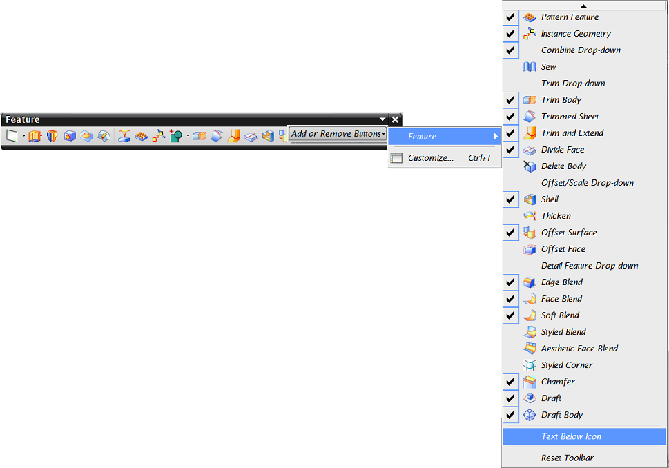
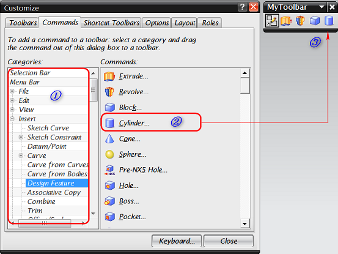

# UG NX 角色定制与应用

2013-08-05

---

UG NX根据用户的经验水平、行业或者公司标准提供了一种先进的界面控制方式——`角色`。用户可在指定的角色下保存界面设置，该界面可以仅保留当前任务所需要的命令，从而简化用户界面，提高操作效率。

第一次启动NX时，系统默认的使用的角色为基本功能角色，包括了一些常用命令，适合新手用户或临时用户。随着使用的深入，用户自然会产生个性化定制的需求。本文将以图文教程的方式，详细介绍UG NX角色的定制与使用。

角色的用户界面包括两个方面：

* 工具条/菜单内容，分为系统、自定义工具条/菜单的定制，是本文阐述的主要部分；

* 显示风格，主要根据用户的操作习惯设置工具栏、菜单显示位置、方式等。

下图为定制后的界面示意图。

## 系统角色

在资源条的role角色选项卡上已经内置了一些角色，我们可以选择并使用他们；并且可以在其基础上进行定制，但是需要将定制结果新建为用户角色或保存角色文件，才可以保留定制效果并在以后调用。

为了方便下面的定制，选择具有完全菜单的角色——Advanced with full menus。

接下来对系统已有菜单、工具条进行菜单项、工具条按钮的选择性显示，也可以完全自定义自己的工具条。这里需要说明的是：使用的仍然是系统提供的基本工具条按钮、菜单项，只不过是以我们需要的方式重新进行组合；如果需要开发自定义功能的按钮、菜单项，则需要二次开发的知识，不在本文讨论范围。

## 定制系统菜单

`Tools -> Customize`或者直接使用快捷键`Ctrl+1`打开工具条/菜单自定义面板，即可通过拖拽自定义菜单或者菜单项。如下图所示：

* 切换到`command`面板，在左侧`Categories`中选择菜单栏`Menu Bar`，可以任意拖拽右侧的菜单到UG菜单栏的任意位置。

* 点击某个菜单，可以任意拖拽菜单项，也可以将用户自定义面板中任意按钮或菜单项拖拽进去。

## 定制系统工具条

在常规状态下，右击工具栏空白处，通过选择/取消勾选可以控制工具条的显示和隐藏，对于已经显示的工具条，单击右侧的小三角图标，可以控制工具栏内图标的显示和隐藏。

在自定义状态下（`Tools -> Customize`），选择工具条`Toolbars`面板①，可以控制系统工具条的显隐，然后切换到命令`Commands`面板②，配合`Categories`和`Commands`选择需要的功能按钮③④，将其拖拽到系统工具条上⑤。

在用户自定义面板的工具条选项卡下有三个系统工具条——`Radial 1`、`Radial 2`、`Radial 3`，分别对应快键工具条`Ctrl+Shift+左键`、`Ctrl+Shift+中键`、`Ctrl+Shift+右键`，也可以按照上面的方法拖拽布置新的按钮。

## 定制用户工具条

我们也可以自定义一个工具条，组织一些特定功能的按钮。基本步骤如下：

* 在用户自定义面板中点击`New`按钮新建工具条，命名并选择启用的模块（即在那些模块下，这个自定义工具条是可用的）。确定后出现新的空白工具条。

* 类似自定义系统工具条的方法，任意拖拽新的内容（菜单项、按钮或者菜单）到新建的工具条中。例如下面两幅图分别显示两种不同风格的自定义工具条。对于第二种菜单形式的自定义工具条，还可以任意修改其显示名称。

## 定制工具条/菜单显示风格

完成定制后，还可以设置停靠位置，显示的风格如是否显示名称、图标的大小等。

* 停靠位置：根据需要和习惯，拖拽工具条到四周任意位置，待其自动停靠后释放鼠标。

* 通过勾选/取消`Text Below Icon`复选框决定是否显示按钮名称。

* 在`Costomize->Options`面板下设置图标的大小。

## 创建和应用角色

完成以上设置后，需要保存设置以便下次调用。可以有两个方法：

* **新建用户角色**

    在资源条角色面板空白处右击，选择`New User Role`，新建用户角色，依次填写用户角色名称、显示图片、描述说明等，最终在用户角色`User`分组下即可查看新建的角色。在以后的应用中，只需从资源条角色面板选择该角色图标，即可导入该角色的所有设置。

    

    

* **保存角色文件**

    将用户自定义`Costomize`面板切换到角色`Roles`选项卡，单击`Create`创建角色配置`.mtx`文件。该文件记录了之前对工具条、菜单的所有设置，将来需要使用该配置时，点击`Load`选择相应的`.mtx`角色文件即可。

    

## 总结

本文详细介绍了UG NX角色的定制和应用方法，基本流程概括为：

* 在资源条选择最接近需求的角色，以其为基础开始定制；

* 在最常用的应用模块中定制系统工具条、菜单或新建自定义工具条，设置工具条停靠位置、显示风格等；

* 完成设置后创建自定义角色或者直接导出角色文件以便以后加载使用。