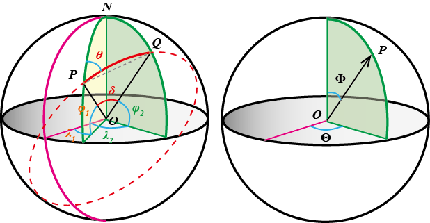

# 球面距离与方位角公式的推导：向量代数法

---

[前一篇文章](2017-03-08-球面距离与方位角公式的推导：解三角形法.md)从几何的角度，
使用常规的解三角形法推导了球面上两点间的最短距离、方位角公式；本文将从代数的角度，直接使用向量计算的方法进行推导。

## 概述

本文需要推导的公式都是基于标准球体的假设，并且经纬度坐标的定义类似于球坐标系，因此可以使用球坐标系来描述空间位置。
下图显示了经纬度的定义和标准球坐标系不同之处，其中左图为经纬度等物理量在单位球中的示意，右图为标准球坐标系的定义。

- `纬度`是地球上某点与球心的连线与地球赤道面所成的线面角（如图所示$\varphi$），北纬为正数，南纬为负数。

- `经度`是地球上某点经线平面与本初子午面所成的二面角（如图所示的$\lambda$），东经为正数，西经为负数。

- `方位角`是从某点的指北方向线起，依顺时针方向到目标方向线之间的水平夹角（如图所示$\theta$）。

根据上述定义可知，在单位球面上，经纬度$(\varphi,\lambda)$与球坐标$(\Phi, \Theta)$之间的对应关系为：

\begin{align\*}
    \Phi   &= \frac{\pi}{2} - \varphi \\\\
    \Theta &=
            \begin{cases}
                \lambda + 2\,\pi   & -\pi \le \lambda \le 0 \\\\
                \lambda            & 0 \le \lambda \le \pi
            \end{cases}
\end{align\*}

于是，直角坐标系与球坐标系的对应关系

$$
\left\{ 
    \begin{array}{c}
        x = \sin\Phi \cos\Theta \\
        y = \sin\Phi \sin\Theta \\
        z = \cos\Phi
    \end{array}
\right.
$$

转换到经纬度坐标系下为：

$$
\left\{ 
    \begin{array}{c}
        x = \cos\varphi \cos\lambda \\
        y = \cos\varphi \sin\lambda \\
        z = \sin\varphi
    \end{array}
\right.
$$

## 球面距离公式

球面上两点P、Q的最短距离为过P、Q的大圆对应两点之间的劣弧的长度（如图实线所示$\overset{\frown}{PQ}$）。

球面距离$d$的常用计算公式为`Haversine`公式 [^1] [^2]：

\begin{align\*}
a &= \sin^2\frac{\Delta\varphi}{2} + \cos\varphi_1 \cos\varphi_2 \, sin^2\frac{\Delta\lambda}{2}\\\\
\delta &= 2\,atan2\frac{\sqrt{a}}{\sqrt{1-a}} \\\\
d &= R\,\delta\\\\
\tag{I}
\end{align\*}

其中，$\varphi$是纬度，$\lambda$是经度，$R$是地球平均半径（$R=6371km$）。$\Delta\varphi=\varphi_2-\varphi_1$，$\Delta\lambda=\lambda_2-\lambda_1$
分别为纬度、经度的差值。

!!! warning "注意："
    - 代入计算的经、纬度为换算后的弧度值。
    - 公式中反正切函数`atan2()`区别于常规的`atan()`。

**分析：** 根据经纬度得到P、Q点的笛卡尔坐标，代入两点间距离公式计算球心角对应的弦长，最终得到球心角。

P、Q在笛卡尔坐标系下表示为：

$$
\left\{ 
    \begin{array}{c}
        x_1 = \cos\varphi_1 \cos\lambda_1 \\
        y_1 = \cos\varphi_1 \sin\lambda_1 \\
        z_1 = \sin\varphi_1
    \end{array}
\right. 
\quad
\left\{ 
    \begin{array}{c}
        x_2 = \cos\varphi_2 \cos\lambda_2 \\
        y_2 = \cos\varphi_2 \sin\lambda_2 \\
        z_2 = \sin\varphi_2
    \end{array}
\right.
$$

代入两点间距离公式：

\begin{align\*}
PQ^2 &= (\Delta x)^2 + (\Delta y)^2 + (\Delta z)^2 \\\\
     &= (\cos\varphi_1 \cos\lambda_1 - \cos\varphi_2 \cos\lambda_2)^2 + 
        (\cos\varphi_1 \sin\lambda_1 - \cos\varphi_2 \sin\lambda_2)^2 + 
        (\sin\varphi_1 - \sin\varphi_2)^2 \\\\
     &= 2 - 2\,\sin\varphi_1 \sin\varphi_2 - 2\,\cos\varphi_1 \cos\varphi_2 \cos\Delta\lambda\\\\
     &= 2 - 2\,\cos\Delta\varphi + 4\,\cos\varphi_1 \cos\varphi_2 \sin^2\frac{\Delta\lambda}{2}\\\\
     &= 4\,sin^2\frac{\Delta\varphi}{2} + 4\,\cos\varphi_1 \cos\varphi_2 \sin^2\frac{\Delta\lambda}{2}
\end{align\*}

令$a=(PQ/2)^2$即可得到`Haversine`公式。

以上式为基础，可以进一步推导余弦形式的球面距离公式：

$$
    a = \sin^2\frac{\delta}{2}
$$

于是，

\begin{align\*}
    \cos\delta &= 1 - 2\,\sin^2\frac{\delta}{2} = 1 - 2\,a \\\\
               &= 1 - 2\,sin^2\frac{\Delta\varphi}{2}- 2\,\cos\varphi_1 \cos\varphi_2 \sin^2\frac{\Delta\lambda}{2}\\\\
               &= \cos\Delta\varphi - \cos\varphi_1 \cos\varphi_2 \left( 1 - \cos\Delta\lambda \right) \\\\
               &= \left( \cos\Delta\varphi - \cos\varphi_1 \cos\varphi_2 \right) + \cos\varphi_1 \cos\varphi_2 \cos\Delta\lambda \\\\
               &= \sin\varphi_1 \sin\varphi_2 + \cos\varphi_1 \cos\varphi_2 \cos\Delta\lambda
    \tag{*}\label{eq:1}
\end{align\*}

!!! note "说明："
    以上关于角度的推导基于单位球，即$OP=OQ=1$。

## 方位角公式

方位角$\theta$的计算公式：

$$
\theta = atan2\frac{\sin\Delta\lambda \cos\varphi_2}{\cos\varphi_1 \sin\varphi_2-\sin\varphi_1 \cos\varphi_2\,\cos\Delta\lambda}
\tag{II}
$$

**分析：** 如下图所示，P点处方位角$\theta$为过P点的两个大圆在该点处切线方向向量$\boldsymbol{\tau_1},\,\boldsymbol{\tau_2}$的夹角。 

\begin{align*}
    \boldsymbol{\tau_1} &= \boldsymbol{\alpha} \times \boldsymbol{n_1} = \boldsymbol{\alpha} \times \left( \boldsymbol{\beta} \times \boldsymbol{\alpha} \right) \\\\
    \boldsymbol{\tau_2} &= \boldsymbol{\alpha} \times \boldsymbol{n_2} = \boldsymbol{\alpha} \times \left( \boldsymbol{\gamma} \times \boldsymbol{\alpha} \right)
\end{align\*}

其中，

\begin{align*}
    \boldsymbol{\alpha} &= \left( \cos\varphi_1 \cos\lambda_1, \, \cos\varphi_1 \sin\lambda_1, \, \sin\varphi_1 \right)\\\\
    \boldsymbol{\beta}  &= \left( \cos\varphi_2 \cos\lambda_2, \, \cos\varphi_2 \sin\lambda_2, \, \sin\varphi_2 \right)\\\\
    \boldsymbol{\gamma} &= \left( 0, \, 0, \, 1\right)
\end{align\*}

易知 
$\Vert \boldsymbol{\alpha} \Vert = \Vert \boldsymbol{\beta} \Vert = \Vert \boldsymbol{\gamma} \Vert = 1$，
进而可知 
$\Vert \boldsymbol{\tau_1} \Vert = \sin\delta$，
$\Vert \boldsymbol{\tau_2} \Vert = \cos\varphi_1$。

参考向量叉积的运算规律 [^3] [^4]，进行如下计算：

\begin{align*}
    \boldsymbol{\tau_1} \cdot \boldsymbol{\tau_2} &= \left[ \boldsymbol{\alpha} \times \left( \boldsymbol{\beta} \times \boldsymbol{\alpha} \right) \right] \cdot
                \left[ \boldsymbol{\alpha} \times \left( \boldsymbol{\gamma} \times \boldsymbol{\alpha} \right) \right]\\\\
            &= \left ( \boldsymbol{\alpha} \cdot \boldsymbol{\alpha} \right) \cdot \left[ \left( \boldsymbol{\beta} \times \boldsymbol{\alpha} \right) \cdot \left( \boldsymbol{\gamma} \times \boldsymbol{\alpha} \right) \right] - 
                   \left[ \boldsymbol{\alpha} \cdot \left( \boldsymbol{\gamma} \times \boldsymbol{\alpha} \right) \right] \cdot
                   \left[ \left( \boldsymbol{\beta} \times \boldsymbol{\alpha} \right) \cdot \boldsymbol{\alpha} \right] \\\\
            &= \left( \boldsymbol{\beta} \times \boldsymbol{\alpha} \right) \cdot \left( \boldsymbol{\gamma} \times \boldsymbol{\alpha} \right)\\\\
            &= \left( \boldsymbol{\beta} \cdot \boldsymbol{\gamma} \right) \cdot \left( \boldsymbol{\alpha} \cdot \boldsymbol{\alpha} \right) - 
                   \left( \boldsymbol{\beta} \cdot \boldsymbol{\alpha} \right) \cdot \left( \boldsymbol{\alpha} \cdot \boldsymbol{\gamma} \right)\\\\
            &= \boldsymbol{\beta} \cdot \boldsymbol{\gamma} - \left( \boldsymbol{\alpha} \cdot \boldsymbol{\beta} \right) \cdot \left( \boldsymbol{\alpha} \cdot \boldsymbol{\gamma} \right)
\end{align\*}

其中，

\begin{align*}
    \boldsymbol{\alpha} \cdot \boldsymbol{\gamma} &= \sin\varphi_1\\\\
    \boldsymbol{\beta} \cdot \boldsymbol{\gamma} &= \sin\varphi_2\\\\
    \boldsymbol{\alpha} \cdot \boldsymbol{\beta} &= \sin\varphi_1 \sin\varphi_2 + \cos\varphi_1 \cos\varphi_2 \cos\Delta\lambda
\end{align\*}

代入计算：

\begin{align*}
    \boldsymbol{\tau_1} \cdot \boldsymbol{\tau_2} &= \sin\varphi_2 - \sin^2\varphi_1 \sin\varphi_2 - \sin\varphi_1 \cos\varphi_1 \cos\varphi_2 \cos\Delta\lambda\\\\
                                                  &= \cos^2\varphi_1 \sin\varphi_2 - \sin\varphi_1 \cos\varphi_1 \cos\varphi_2 \cos\Delta\lambda\\\\
                                                  &= \cos\varphi_1 \left( \cos\varphi_1 \sin\varphi_2 - \sin\varphi_1 \cos\varphi_2 \cos\Delta\lambda \right)
\end{align\*}

于是，

\begin{align*}
    \cos\theta &= \frac{\boldsymbol{\tau_1} \cdot \boldsymbol{\tau_2}}{\Vert \boldsymbol{\tau_1} \Vert \, \Vert \boldsymbol{\tau_2} \Vert}\\\\
               &= \frac{\cos\varphi_1 \sin\varphi_2 - \sin\varphi_1 \cos\varphi_2 \cos\Delta\lambda}{\sin\delta}\\\\
               &= \frac{t}{\sin\delta}
    \tag{**}\label{eq:2}
\end{align\*}

其中，$t = \cos\varphi_1 \sin\varphi_2 - \sin\varphi_1 \cos\varphi_2 \cos\Delta\lambda$。

结合式\eqref{eq:1}和式\eqref{eq:2}可得：

\begin{align\*}
\tan^2\theta &= \sec^2\theta - 1\\\\
             &= \frac{1}{t^2}\,\left( \sin^2\delta - t^2 \right)\\\\
             &= \frac{1}{t^2}\,\left( 1-\cos^2 \delta-t^2 \right)\\\\
             &= \frac{1}{t^2}\,\left( 1-\sin^2 \varphi_2-\cos^2 \varphi_2 \cos^2\Delta\lambda \right)\\\\
             &= \left( \frac{\cos\varphi_2 \, \sin\Delta\lambda}{t} \right)^2
\tag{***}\label{eq:2.5}
\end{align\*}

即可解出$\theta$的表达式。

## 已知起始点、方位角及距离，求目标位置

已知起始点经纬度$P(\varphi_1,\lambda_1)$，方向角$\theta$及球面距离$d$，计算目标位置$Q(\varphi_2,\lambda_2)$的公式为：

\begin{align\*}
    \varphi_2 &= asin \left( \sin\varphi_1 \cos\delta + \cos\varphi_1 \sin\delta \cos\theta \right)\\\\
    \lambda_2 &= \lambda_1 + atan2 \frac{\sin\theta \sin\delta \cos\varphi_1}{\cos\delta-\sin\varphi_1 \sin\varphi_2}
    \tag{III}\label{eq:3}
\end{align\*}

其中，球心角$\delta = d/R$。

**分析：** 根据球面距离公式和方位角公式反求目标位置即可。

结合式\eqref{eq:1}和式\eqref{eq:2}分别得到：
\begin{align\*}
    \sin\delta \cos\theta &= \cos\varphi_1 \sin\varphi_2 - \sin\varphi_1 \cos\varphi_2 \cos\Delta\lambda \tag{①}\label{eq:4}\\\\
    \cos\delta &= \sin\varphi_1 \sin\varphi_2 + \cos\varphi_1 \cos\varphi_2 \cos\Delta\lambda \tag{②}\label{eq:5}
\end{align\*}

$\eqref{eq:4} \times \cos\varphi_1 + \eqref{eq:5} \times \sin\varphi_1$得：

$$
    \sin\varphi_2 = \sin\varphi_1 \cos\delta + \cos\varphi_1 \sin\delta \cos\theta
$$

即可解出\eqref{eq:3}的第一个式子。

结合式\eqref{eq:2}和式\eqref{eq:2.5}可得：

$$
    \sin\theta = \frac{\sin\Delta\lambda \, \cos\varphi_2}{\sin\delta}
$$

即

$$
    \sin\Delta\lambda = \frac{\sin\theta\,\sin\delta}{\cos\varphi_2}
$$

由式\eqref{eq:1}可知：

$$
    \cos\Delta\lambda = \frac{\cos\delta-\sin\varphi_1 \, \sin\varphi_2}{\cos\varphi_1 \, \cos\varphi_2}
$$

以上两个式子相除即可得到：

$$
    \tan\Delta\lambda = \frac{\sin\theta \sin\delta \cos\varphi_1}{\cos\delta-\sin\varphi_1 \sin\varphi_2}
$$

于是，解出Q点的经度$\lambda_2 = \lambda_1 + \Delta\lambda$如式\eqref{eq:5}的第二式所示。

[^1]: [Calculate distance, bearing and more between Latitude/Longitude points](http://www.movable-type.co.uk/scripts/latlong.html)  

[^2]: [Haversine formula](https://en.wikipedia.org/wiki/Haversine_formula)  

[^3]: [Cross product](https://en.wikipedia.org/wiki/Cross_product)  

[^4]: [Triple product](https://en.wikipedia.org/wiki/Triple_product) 