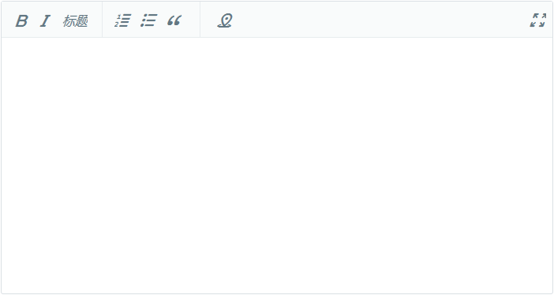
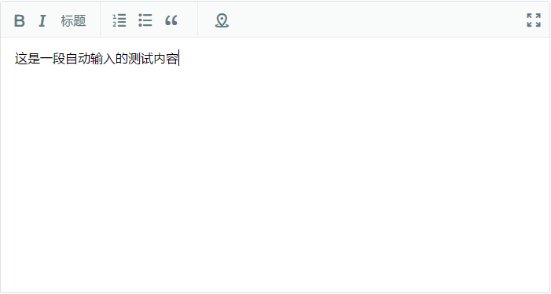

# Selenium+PhantomJS无法输入文本及其解决方法


---

`Selenium`是一个Web应用程序自动化测试工具，可以结合不同的webDriver（如Chrome、Firefox、Opera、PhantomJs）进行程序功能、兼容性方面的测试，也可进行爬虫相关的页面获取和分析。

本文记录使用Selenium Python的`send_keys`方法进行文本输入时遇到的问题及其解决方法。

## 问题描述

使用PhantomJS的WebDriver，无法在百度知道回答页面的编辑器中输入文本；改用Chrome驱动，则不存在此问题。

``` python
# encoding=utf8
from selenium import webdriver
from selenium.webdriver.support.ui import WebDriverWait

# 初始化webdriver
driver = webdriver.PhantomJS()
# driver = webdriver.Chrome()

# 窗口最大化 ①
driver.maximize_window()

# 获取页面
driver.get("https://zhidao.baidu.com/question/524279537996642125.html")

# 等待页面加载完毕 ②
wait = WebDriverWait(driver, 5)
try:
    wait.until(lambda the_driver: the_driver.find_element_by_id('ueditor_0').is_displayed())
except:
    driver.quit()
    raise Exception('load page failed.')

# 输入内容
content = u'这是一段自动输入的测试内容'
driver.switch_to.frame('ueditor_0')
content = driver.find_element_by_tag_name('body')
content.clear()
content.send_keys(content)

# 截图观察结果
driver.save_screenshot('results.png')
driver.quit()
```

注解：

① 对于PhantomJS，需要最大化窗口（或者设置宽高），否则某些页面元素可能无法显示而导致出错

② 这里采用`显式等待`，目标元素出现则表明页面加载完成

使用PhantomJS和Chrome驱动的结果分别如下图所示，可见前者无法实现文本的正确输入。







## 原因分析

一开始怀疑是为`input`，`textarea`等之外的不具备输入属性的元素使用`send_keys`方法而出现的bug，然而[百度编辑器测试页面](http://ueditor.baidu.com/website/onlinedemo.html)具有类似的结构，使用上述代码却可以实现文本的正常输入。因此排除`iframe`的影响，排除`body`作为输入容器的原因。

具体原因暂且未知。

## 解决方法

**既然无法使用`send_keys`方法，那就改用javascript代码设置元素内容**：

``` python
js = "document.getElementById('id').innerHTML = ' % s'" % content
driver.execute_script(js)
```

本问题中，目标元素在`iframe`标签内，所以需要使用如下获取元素的方法：

``` javascript
obj = document.getElementById('frame_id').contentWindow.document.getElementsById('target_id')
```

综上，解决本问题的主要代码为：

``` python
# 输入内容
content = u'这是一段自动输入的测试内容'
js = "document.getElementById('ueditor_0').contentWindow.\
    document.getElementsByTagName('body')[0].innerHTML = ' % s'" % content
driver.execute_script(js)
```