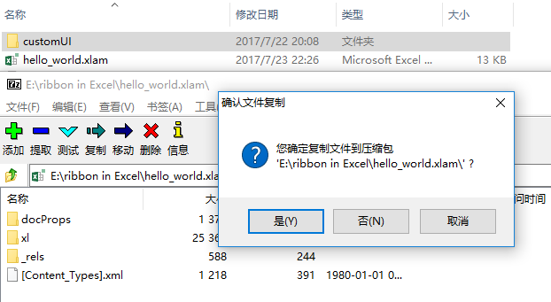

# Microsoft Excel 2010自定义功能区：修改XML


---

[手工创建自定义Excel选项卡](2017-07-23-Microsoft-Excel-2010自定义功能区：手工创建.md)的方法在可移植性方面存在不足，本文将以前文的`hello_world.xlam`为基础，记录将自定义功能区的菜单项集成到插件中去的基本步骤。


## 创建自定义功能区的`xml`文件

自定义功能区的选项卡、分组、菜单项可以使用`xml`格式文件的`tab`，`group`，`button`等标签来组织，其中常用的属性有：

* `label`属性为显示的名称

* `onAction`属性为相应的回调函数，例如`btn1`对应的函数为`user_fun`

* `imageMso`属性控制菜单项的显示图标 [^1]


以下是本文简单示例的`xml`结构：

```xml
<customUI xmlns="http://schemas.microsoft.com/office/2006/01/customui">
    <ribbon startFromScratch="false">
        <tabs>
            <tab id="userRibbon" label="自定义Ribbon选项卡">
                <group id="g1" label="自定义组一">
                    <button id="btn1" 
                        imageMso="Alerts" 
                        size="large" 
                        label="say hello world" 
                        onAction="user_fun"/>
                </group>

                <group id="g2" label="自定义组二">
                    <button id="btn2" 
                        imageMso="Help" 
                        size="large" 
                        label="About" 
                        onAction="about_fun"/>
                </group>
            </tab>
        </tabs>
    </ribbon>
</customUI>
```

关于自定义功能区的`xml`文件的具体说明，可以参考微软提供的文档 [^2] [^3] [^4] [^5]。


大致了解以上背景知识后，正式开始操作步骤：

- 新建`customUI`文件夹，在该文件夹下新建`CustomUI.xml`文件，文件内容为以上示例`xml`代码。注意保存以`UTF-8`编码保存文件。

- 以解压缩软件例如`7-zip`直接打开`hello_world.xlam`，然后将整个`customUI`文件夹拖入到压缩文件中并保存。





## 修改`.res`文件

接下来继续在以压缩包形式打开的`hello_world.xlam`文件上进行操作：

- 右键压缩包中`_res`文件夹下的`.res`文件，在弹出菜单中选择`编辑`，以记事本方式打开`.res`文件。

- 在`.rels`文件最后一个`</Relationships>`标签之前添加如下内容，保存并在提示更新压缩文件时选择确定。

```xml
<Relationship Id="customUIRelID" 
    Type="http://schemas.microsoft.com/office/2006/relationships/ui/extensibility" 
    Target="customUI/customUI.xml"/>
```

完成以上步骤后打开`hello_world.xlam`得到如下效果：


## 编辑`VBA`代码

`xml`中为`say hello world`指定的回调函数是`user_fun`，所以最后完成该子过程即可。新建模块（module）重命名为`user_function`，在其中写入以下代码：

```vb
Sub user_fun(Control As IRibbonControl)
    MsgBox "Hello world."
End Sub
```

特别注意，该过程需要带参数`control As IRibbon`。


最后，本文示例文件[hello_world_addin.xlam](https://github.com/dothinking/dothinking.github.io/tree/master/samples/excel_ribbon)供参考。


[^1]: [Office 2010 Add-In: Icons Gallery](https://www.microsoft.com/en-us/download/details.aspx?displaylang=en&id=21103)

[^2]: [A Guide to Customizing the Office 2007 Ribbon](https://technet.microsoft.com/en-us/library/2009.05.ribbon.aspx#id0980025)  

[^3]: [Customizing the 2007 Office Fluent Ribbon for Developers (Part 1 of 3)](https://msdn.microsoft.com/en-us/library/aa338202.aspx)

[^4]: [Customizing the 2007 Office Fluent Ribbon for Developers (Part 2 of 3)](https://msdn.microsoft.com/en-us/library/aa338199(v=office.12).aspx)

[^5]: [Customizing the 2007 Office Fluent Ribbon for Developers (Part 3 of 3)](https://msdn.microsoft.com/en-us/library/aa722523(v=office.12).aspx)
