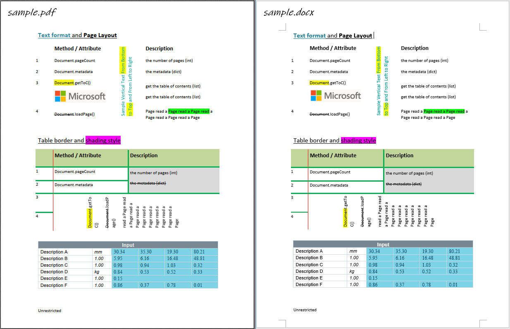

# pdf2docx开发概要

---

**PDF转Word** 是一个古老的话题，其难点在于建立PDF基于元素位置的格式与Word基于内容的格式之间的映射关系。[`Solid Documents`](https://solidframework.net/)是这方面的佼佼者，其技术的应用案例：在线PDF转换网站[Smallpdf](https://smallpdf.com/pdf-to-word)。

在某个项目的调研过程中，我尝试了这个话题，编写了一个用于转换PDF到Word的Python库`pdf2docx`——借助`PyMuPDF`从PDF文件提取内容，基于位置规则解析内容，最后用`python-docx`创建Word文件。

> https://github.com/dothinking/pdf2docx

本文记录主要开发思路，具体细节随着版本升级可能略有差异。

## 思路

- PDF文件遵循一定的格式规范 [^1]，Python库[`PyMuPDF`](https://github.com/pymupdf/PyMuPDF)提供了便利的解析函数，用于获取页面元素例如文本和形状及其位置。

- 利用元素间的相对位置关系推断内容，例如将“横纵线条围绕着文本”解析为“表格”，将“文本下方的一条横线”解析为“文本下划线”。这就是本文主角`pdf2docx`的主要内容。

- 使用Python库`python-docx`将上一步解析的内容元素重建为docx格式的Word文档。

以上技术路线也决定了`pdf2docx`的局限：

- 只能处理标准格式的PDF，不支持扫描版、图片格式PDF。

- 只能处理水平、竖直方向文本，忽略旋转角度的文本。

- 根据有限的、确定的规则建立PDF导出元素位置与docx要求的内容之间的映射并非完全可靠，也就是说仅能处理常见的规范的格式，而非百分百还原。

## 目录

以下分篇介绍提取PDF页面数据、解析和重建docx过程中的具体细节：

- [提取文本、图片和形状](2020-07-14-pdf2docx开发概要：提取文本、图片和形状.md)

    - [获取图片及其位置](2020-10-15-pdf2docx开发概要：获取图片及其位置.md)
    - [创建浮动图片](2020-10-25-pdf2docx开发概要：创建浮动图片.md)
    - [矢量图处理](2021-06-26-pdf2docx开发概要：矢量图处理.md)

- [解析页面布局](2021-05-30-pdf2docx开发概要：解析页面布局.md)

- [解析表格](2020-08-15-pdf2docx开发概要：解析表格.md)

    - [对齐隐式表格线](2020-09-27-pdf2docx开发概要：对齐隐式表格线.md)

- [解析段落](2020-08-27-pdf2docx开发概要：解析段落.md)

    - [解析文本样式](2020-07-20-pdf2docx开发概要：解析文本样式.md)

[^1]: [PDF Reference 1.7](https://www.adobe.com/content/dam/acom/en/devnet/pdf/pdf_reference_archive/pdf_reference_1-7.pdf)