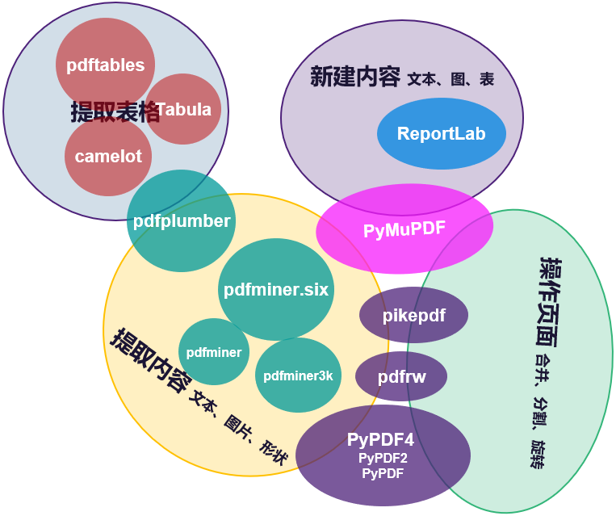

# Python处理PDF的第三方库对比

---

PDF（Portable Document Format）是一种便携文档格式，便于跨操作系统传播文档。PDF文档遵循标准格式，因此存在很多可以操作PDF文档的工具，Python自然也不例外。面多众多的Python第三方库，本文从功能、开源协议及社区活跃度三方面加以对比，以便根据具体需求选择合适的库。

## 概况

功能对比从大粒度上分成了`提取内容`、`操作页面`和`创建内容`三方面。前两者分别是针对已经存在的PDF文档的读和写操作，最后一项从内容上创建新文档。考虑到时效性，以下对比列出了撰文时相应的最新版本。

- `提取内容`如文本、图片、元信息
- `操作页面`特指操作已经存在的页面例如分割、合并、裁剪、旋转等
- `创建内容`指创建或修改页面内容，例如文本、图片、形状

Python库 | 当前版本 | Python版本 | 开源协议 | 最新更新 | 功能：提取内容 | 功能：操作页面 | 功能：创建内容 | 备注
- | - | - | - | - | - | - | - | -
[PyPDF2](https://github.com/mstamy2/PyPDF2) | 1.26.0 | 2.6-3.6 | modified BSD | 3年前 | √ | √ | × | `PyPDF2`已不再维护，继任者[`PyPDF4`](https://github.com/claird/PyPDF4)（[`PyPDF`](https://github.com/mfenniak/pyPdf)、`PyPDF2`及`PyPDF4`的渊源参考[此处](https://realpython.com/pdf-python/)）。*由于`PyPDF2`似乎更知名，故以其作为条目列出。*
[pdfrw](https://github.com/pmaupin/pdfrw) | 0.4 | 2.6-3.6 | MIT | 3年前 | √ | √ | × | 自身不能创建新内容，但是集成了`ReportLab`，可以兼容`ReportLab`生成新页面
[ReportLab](https://www.reportlab.com/opensource/) | 3.5.58 | 2.7， 3.6+ | BSD | 非常活跃 | × | × | √ | [`ReportLab`](https://www.reportlab.com/)的开源版本，专业创建PDF内容如文本、图表等
[pikepdf](https://github.com/pikepdf/pikepdf) | 2.2.4 | 2.7， 3.6+ | MPL 2.0 | 非常活跃 | √ | √ | × | 基于C++的[`QPDF`](https://github.com/qpdf/qpdf)，对标`PyPDF2`和`pdfrw`；偏向底层
[pdfplumber](https://github.com/jsvine/pdfplumber) | 0.5.25 | 3.6-3.8 | MIT | 活跃 | √ | × | × | 基于`pdfminer.six`；除了文本、形状（矩形、直线/曲线），还能**解析表格**。*几个提取PDF表格的Python库的对比参考[此处](https://github.com/atlanhq/camelot/wiki/Comparison-with-other-PDF-Table-Extraction-libraries-and-tools#pdf-table-extract)*
[pdfminer.six](https://github.com/pdfminer/pdfminer.six) | 20201018 | 3.6+ | MIT | 2个月前 | √ | × | × | [`pdfminer`](https://github.com/euske/pdfminer/)的社区维护版，因为`pdfminer`自2020年起不再积极维护
[PyMuPDF](https://github.com/pymupdf/PyMuPDF) | 1.18.5 | 3.6+ | GPL V3 | 非常活跃 | √ | √ | √ | 基于[`mupdf`](https://mupdf.com/)；以处理速度著称，参考[此处](https://pymupdf.readthedocs.io/en/latest/app1.html)

## 点评

- `PyPDF2`系列、`pdfrw`及`pikepdf`专注对已经存在的PDF的操作（分割、合并、旋转等），前两者基本处于停止维护的状态。
- `pdfplumber`及其依赖`pdfminer.six`专注PDF内容提取，例如文本（位置、字体及颜色等）和形状（矩形、直线、曲线），前者还有解析表格的功能。
- `ReportLab`专注PDF页面内容（文本、图、表等）的创建。
- `PyMuPDF`功能全面且速度快，但是`GPL v3`的开源协议对商用不友好。

最后，用下图的总结结束全文。

