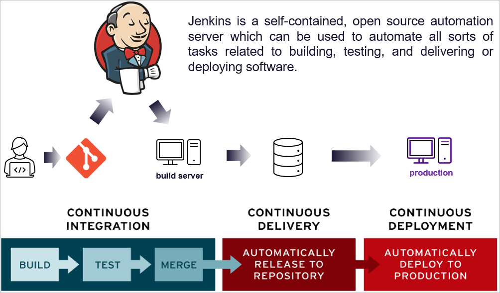
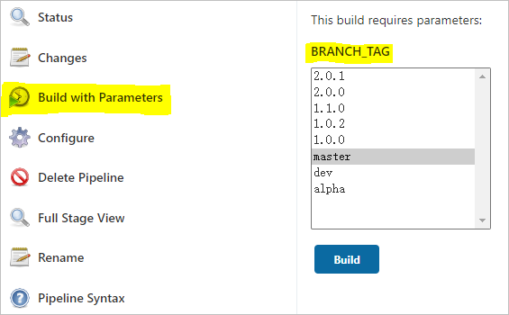
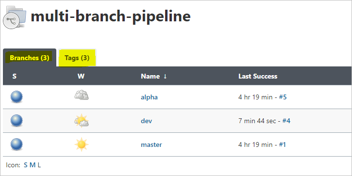

# Jenkins入门：创建项目


---

Jenkins是CI/CD链条中连接上游版本管理和下游构建、测试、部署的重要一环。即便版本管理与CI/CD日趋融合的今天，例如GitLab CI、GitHub Action的兴起，Jenkins以其先发优势和强大扩展性仍旧聚集了大量用户。本文在参数化构建的前提下，循序渐进地介绍使用Jenkins创建`Freestyle`、`Pipeline`及`Multibranch Pipeline`项目的要点。




## 参数化构建

作为入门，我们选择在Jenkins页面上手动执行/构建/build项目；一个仓库通常包含多个分支，那么能否在同一个项目中根据需要选择性构建某个分支呢？这就是参数化构建，在开始构建之前指定某个参数。设置方式：

> General -> This project is parameterized

这里我们关心的参数是分支名称。数据来源形式有很多，例如手动指定默认的选项（master, alpha, beta等），但更好的方式是直接从仓库中读取。这就需要Git Parameter插件的支持。安装插件后，在项目配置页开启参数化构建，选择Git Parameter，并配置如下具体内容（仅列出关键项）：

- `Name` 参数名称，本文以`BRANCH_TAG`为例，则后续其他地方可以引用`${BRANCH_TAG}`

- `Parameter Type`选择`Branch or Tag`表示同时关心分支名和标签

- `Default Value`默认分支名，例如`master`

- `Branch Filter`填写`origin/(.*)`，完整的分支名通常是`origin/xxx`，因此需要提取出名字本身`xxx`


这一步设置的效果是Jenkins UI上的构建按钮从`Build Now`变成了`Build with Parameters`，即需要指定参数后才能继续；并且自动列出了仓库中的所有分支和标签。




## Freestyle项目

最基础、灵活的配置方式，可以配置以下六个方面：

- `General` 基本设置，如是否参数化构建、是否指定节点执行此项目。

    *如上一节描述进行参数化构建设置，参数名`BRANCH_TAG`*

- `Source Code Management`指定源码
    - git仓库地址、登陆凭证、分支名称，其中分支名称使用`${BRANCH_TAG}`，以便进行参数化构建
    - 当然也可以为空，即不针对源码的构建

- `Build Triggers` 触发自动构建的方式例如轮询仓库、仓库的Push操作等。本文手动触发，故略过。

- `Build Environment` 略过

- `Build` 构建方式例如执行shell或者batch脚本。

- `Post-build Actions` 构建完成后的操作例如生成报告、发送邮件等。


Freestyle项目思路清晰简单，但涉及整个构建周期的方方面面；以最大灵活度手动配置上下游，而核心构建过程由脚本完成。考虑到实际应用中Build部分涉及多个阶段，例如构建、测试、发布等，一整段脚本的方式可能不够明晰和灵活，这就引出了下面的`Pipeline`项目。


## Pipeline项目


Pipeline项目将Freestyle项目中的许多手动设置方式改为配置文件`Jenkinsfile`，并且最大的亮点在于以分阶段的方式管理整个构建流程，故而称为`Pipeline`项目。需要配置的方面也从6个减为3个：

- `General` 同上，开启Git Parameter参数化构建。

- `Build Triggers` 同上，略过。

- `Advanced Project Options`指定构建过程的项目显示名称，默认即为项目名。仅为显示效果，故没算做一个配置方面。

- `Pipeline`指定`Jenkinsfile`——遵守Jenkins Pipeline语法规则的脚本。


一个明显的问题，如何指定源码仓库？如上所述，由手动指定改为由Pipeline指定。两种方式指定Pipeline：

- `Pipeline script`：直接在Jenkins页面上输入Pipeline脚本，本文称作UI托管的Jenkinsfile

- `Pipeline script from SCM`：Pipeline脚本随源码一同管理，本文称作源码托管的Jenkinsfile


### 1. UI托管的Jenkinsfile

下面给出一个示例，基本语法参考官网文档。

- 第一步得指定源码仓库，于是有了`stage('Checkout')`这个阶段。

    这部分脚本可借助Snippet Generator自动生成（模板：checkout: Checkout from version control）。

- `Checkout`中分支名称`branches`必须跟随参数变化，因此需要`parameters`部分定义参数`BRANCH_TAG`。

    这部分脚本可借助Snippet Generator自动生成（模板：properties: Set job properties）。

- `stage('Init')`部分是一个应用示例，根据`BRANCH_TAG`参数定义两个环境变量`BRANCH`和`TAG`，分别代表当前构建的是分支还是标签，以便后续有针对性的操作。

    !!! warning "注意"
        `BRANCH_NAME`虽然是Jenkins内置的表示分支名称的环境变量，但是仅在多分支的`Pipeline`项目有效。


- `stage('Build')`是另一个示例，示意Windows上通过默认的cmd和git batch执行shell命令的方式

    - 执行节点`win_agent`是Windows机器，所以用`bat`执行cmd命令
    - 实际需要执行shell命令，所以需要`sh`（Git_Home\bin\sh.exe）执行，并用`-c`指定执行命令的文本


```Jenkinsfile
pipeline {

    agent {label 'win_agent'}
    
    parameters {
        gitParameter name: 'BRANCH_TAG',
            type: 'PT_BRANCH_TAG',
            branchFilter: 'origin/(.*)', 
            tagFilter: '*',
            defaultValue: 'master', 
            selectedValue: 'DEFAULT',
            sortMode: 'DESCENDING_SMART',
            description: 'Select branch/tag to build...'
    }

    stages {
        stage('Checkout') {
            steps {
                echo 'Checkout git repo..'
                checkout([$class: 'GitSCM', 
                          branches: [[name: "${params.BRANCH_TAG}"]], 
                          doGenerateSubmoduleConfigurations: false, 
                          extensions: [], 
                          submoduleCfg: [], 
                          userRemoteConfigs: [[
                              credentialsId: 'bd3cxxxxxxx',
                              url: 'git@gitlab-url/group/name.git']]
                        ])
            }
        }
        stage('Init') { 
            steps { 
              script {
                if (params.BRANCH_TAG =~ /^([0-9]+)\.([0-9]+)\.([0-9]+).*/) {
                    env.BRANCH = params.BRANCH_TAG
                    env.TAG = params.BRANCH_TAG
                } else {
                    env.BRANCH = params.BRANCH_TAG
                    env.TAG = ""
                }
              }
            }
        }
        stage('Build') {
            steps {
                bat "sh -c 'make build'"
            }
        }
        stage('Test') {
            steps {
                bat "sh -c 'make test'"
            }
        }
        stage('Deploy') {
            steps {
                bat "sh -c 'make deploy'"
            }
        }
    }
}
```


### 2. 源码托管的Jenkinsfile


为便于维护，通常将以上Pipeline脚本和源码放一起管理，这就对应定义Pipeline的第二种方式：从下拉框选择`Pipeline script from SCM`，然后指定源仓库的信息，类似于Freestyle项目指定仓库的方式：

- 仓库地址和登陆凭证

- 分支名称，配合参数化构建，输入`${BRANCH_TAG}`

    !!! warning "注意"
        实际上这种传入参数的方式仅适用于Freestyle项目，所以此处`${BRANCH_TAG}`并不会被解析为具体名称，而是原封不动作为git分支名称，导致Checkout仓库失败。一个解决方式是取消勾选最后的`Lightweight checkout`。

- Pipeline脚本相对仓库根目录的路径，这是新增的部分


最终，删除上一段Jenkinsfile中`stage('Checkout')`部分即可直接存入仓库使用。


## 多分支Pipeline项目

借助Git Parameter的参数化构建方式还是有些繁琐，所以Jenkins直接内置了多分支`Pipeline`项目，配置源码仓库后，Jenkins自动为每一个带有Jenkinsfile的分支/标签创建子项目，最终形成`project_name/branch_name`两级项目的结构。


多分支Pipeline项目配置选项略多，作为入门配置只需考虑以下两方面：

- `Branch Sources`指定分支来源

    - 源码仓库和登陆凭证

    - `Behavious`选择`Discover branches`和`Discover tags`，表示同时考虑分支和标签

- `Build Configuration`指定Jenkinsfile在仓库中的路径


注意，我们不再使用前面的参数化构建，且`BRANCH_NAME`对多分支Pipeline项目生效了，故Pipeline脚本做相应的简化：

- 无需`parameters`

- 无需`stage('Checkout')`

- 直接使用`BRANCH_NAME`和`TAG_NAME`

```Jenkinsfile
pipeline {

    agent {label 'win_agent'}

    stages {
        stage('Init') { 
            steps { 
              script {
                if (env.TAG_NAME == null) {
                    env.BRANCH = env.BRANCH_NAME
                    env.TAG = ""
                } else {
                    env.BRANCH = env.TAG_NAME
                    env.TAG = env.TAG_NAME
                }
              }
            }
        }
        stage('Build') {
            steps {
                bat "sh -c 'make build'"
            }
        }
        stage('Test') {
            steps {
                bat "sh -c 'make test'"
            }
        }
        stage('Deploy') {
            steps {
                bat "sh -c 'make deploy'"
            }
        }
    }
}
```

最终结果

