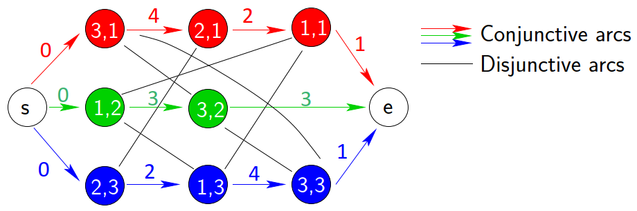
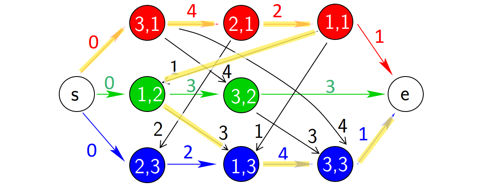
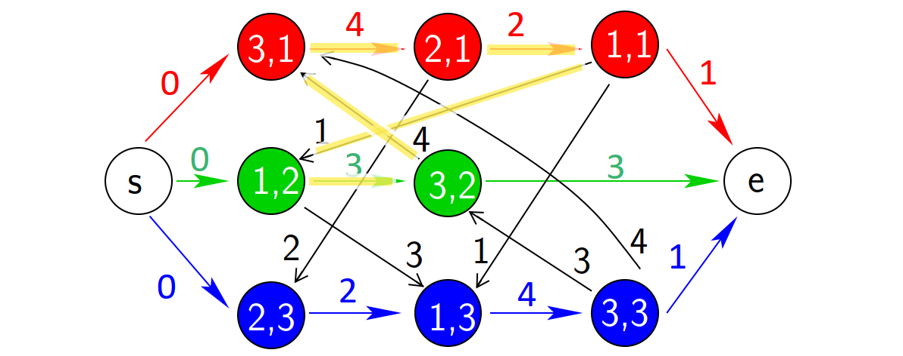

# 作业车间调度问题求解框架：问题描述

---

作业车间调度（Job Shop Schedule）是一个非常经典的组合优化问题，本文记录该问题的基本定义，更直观的示意图解读参考[博文](https://blog.csdn.net/wangzhenyang2/article/details/109046960?spm=1001.2014.3001.5506)。


## 从车间调度问题（Shop Problem）开始

在车间`m`台机器（machine）上调度`n`个作业（job），其中每个作业包含一定数量的步骤/工序（operation）且每个工序需要在给定的某一台机器上来完成。定义：

- 机器集合 $\mathbb{M} = \left \{ 1, 2, \cdots, m \right \}$

- 作业集合 $\mathbb{J} = \left \{ 1, 2, \cdots, n \right \}$

- 工序集合 $\mathbb{O} = \left \{ (i, j) \; | \; i \in \mathbb{M}^j \subset \mathbb{M}, j \in \mathbb{J} \right \}$表示作业$j$的某个将在机器$i$上加工的工序，记录其所需时间为$p_{ij}$。其中$\mathbb{M}^j$是完成作业$j$所有工序所需的机器集合。

接下来根据作业中工序数量和顺序的不同，将车间调度问题分为以下三类：

- 流水车间（Flow shop）：$\mathbb{M}^j=\mathbb{M}$，且$\mathbb{C}_{pre}=\left\{(i, j) \rightarrow (i+1, j)\;|\; i=1,2,\cdots,m−1; j=1,2,\cdots,n \right\}$

- 开放车间（Open shop）：$\mathbb{M}^j=\mathbb{M}$，且$\mathbb{C}_{pre}=\emptyset$

- 作业车间（Job shop）：$\mathbb{C}_{pre}=\left\{ (i_1,j) \rightarrow (i_2,j), \cdots, \rightarrow (i_{|\mathbb{M}^j|}, j) \;|\; j=1,2,\cdots,n \right\}$


其中，$\mathbb{C}_{pre}$表示工序前后顺序的关系。

综合起来，白话就是：

- 流水车间：任意两个作业的工序数相同（$m$），且工序遵循的先后顺序相同，即流水作业
- 开放车间：任意两个作业的工序数相同（$m$），但工序没有前后顺序之分，即无序作业
- 作业车间：任意两个作业的工序数无关，但各自遵循一定的先后顺序，即异序作业


!!! warning "注意"

    流水车间作业的工序顺序相同，但是工序的加工时间可能不同，并且分配到机器后，不同机器上执行作业的顺序可能不同。


## 白话描述

综上，作业车间调度问题可以定义为：

给定$n$个作业，每个作业的加工过程分为若干道工序，每道工序满足（1）序列约束即必须在该作业的前续工序完成后才能开始，（2）资源约束即必须在给定的$m$台机器中确定的 **一台** 上加工且独占该时间段，即每一台机器在某个时刻只能加工一道工序。

在这些约束条件下，规划每道工序的开始加工时刻，使得从第一个开始加工工序的开始时刻到最后一个完成加工工序的完成时刻的时间跨度（makespan）尽可能的短。

举一个3机器3作业的例子：

- 作业1：`(3,1)` -> `(2,1)` -> `(1,1)`，p31 = 4, p21 = 2, p11 = 1
- 作业2：`(1,2)` -> `(3,2)`，p12 = 3, p32 = 3
- 作业3：`(2,3)` -> `(1,3)` -> `(3,3)`，p23 = 2, p13 = 4, p33 = 1

作业1由3道工序组成，分别按机器3，机器2，机器1的顺序加工，加工时间分别为4，2，1；作业2，3同理解读。将其以表格的形式列出来为：

```
--------------------------------------
                工序,时间
 作业   ------------------------------
            1        2        3
--------------------------------------
  1       M3, 4    M2, 2    M1, 1
  2       M1, 3    M3, 3
  3       M2, 2    M1, 4    M3, 1
---------------------------------------
```

## 数学描述

定义工序$(i,j)$的完工时间为$c_{ij}$，则作业车间调度问题等效为如下优化问题：


\begin{align\*}
&\min\,\, c_{m} = \max \left \\{ c_{ij} \, | \, (i,j) \in \mathbb{O} \right \\} \\\\
\\\\
&s.t.\quad
\begin{cases}
c_{ij} \geq p_{ij} & (i,j) \in \mathbb{O} \\\\
\\\\
c_{ij}-c_{kj} \geq p_{ij} & if \,\, (k,j) \rightarrow (i,j), \,\, i, k \in \mathbb{M}^j \\\\
\\\\
c_{ij} - c_{ik} \geq p_{ij} \,\, or \,\, c_{ik}-c_{ij}  \geq p_{ik} & (i,j), (i,k) \in \mathbb{O}, \,\, j \neq k
\end{cases}
\end{align\*}

其中，

- 第一个约束表明工序的开始时间非负
- 第二个是工序序列约束，即同一个作业的相邻工序必须满足先后顺序
- 第三个是资源约束，即每一台机器在某个时刻只能加工一道工序。


这种描述方式符合整数规划模型，便于直接利用实现了高效整数优化算法的求解器进行求解；缺点求解效率受到问题规模的限制。


## 析取图描述

作业车间调度问题表面上是求解工序的开始/结束时间，实际上是工序在机器上的排序问题。于是，涉及两类序列：

- 作业工序链即作业视角上工序的顺序，这个是已知的约束条件
- 机器工序链即分配到相应机器上的所有工序的序列，每个机器的每一种排列方式即对应一种调度方式

于是，产生了用析取图（Disjunctive Graph）来描述作业车间调度问题的方式。

定义图结构$G = (V, C, D)$，其中：

- $V$是节点集合，对应工序集$\mathbb{O}$，以及额外加入的两个等效加工时间都为0的虚拟节点：
    - 源节点（source）$s$：源节点指向所有作业的第一个工序
    - 汇节点（sink）$e$：所有作业的最后一个工序指向汇节点

- $C$是连接边集合（conjunctive arcs），对应作业工序链的顺序关系，由上一工序指向下一工序；同时包括由虚拟节点引入的$2n$条有向边：
    - 源节点指向所有作业的第一个工序的$n$条有向边
    - 所有作业的最后一个工序指向汇节点的$n$条有向边

- $D$是析取边集合（disjunctive arcs），对应潜在的机器工序链连接关系，每一条析取边连接同一机器上加工的两个工序。


还是以前面3机器3作业为例，析取图如下。其中，

- 彩色箭头表示的有向边为连接边集合 $C$，箭头从上一道工序指向下一道工序，定义边的权值为出发节点即上一道工序的加工时间。
- 黑色实线表示的无向边为析取边集合 $D$，相同机器上的工序之间都有一条析取边，例如1号机器上的`(1,1)`、`(1,2)`和`(1,3)`。此时尚未确定边的方向，故权值暂时为空。



### 搜索空间

为所有析取边选择一个方向即确定机器上工序的先后顺序后，析取图退化为有向图，也即对应一种调度方案。根据乘法原理，可能的方案即解的搜索空间大小为：

$$N = \prod_{i=0}^m |\mathbb{J}^i|! $$

其中，$|\mathbb{J}^i|$ 表示机器 $i$ 上加工的工序数量。

显然，问题规模随着机器数和作业数的增加而急剧增大。


### 有向图与路径长度

假设所有机器上的工序都按作业号从小到大排序，例如3号机器上`(3,1)`->`(3,2)`->`(3,3)`，则得到如下一个有向图结构。




有向图反映了作业工序链和机器工序链上工序的顺序关系，并且 **源节点到某节点的最长路径长度即为该工序的开始时间**。于是，源节点到汇结点的最长路径（图中黄色线）即为目标函数（加工周期） $c_m$。

有向图的最长路径算法（例如拓扑排序）有助于我们计算和评估目标函数值。


### 有向无环图

有向图的边很好地表示了工序的先后顺序，但是如果存在 **环**，则会产生矛盾。例如，下面的有向图结构中，黄色线路径构成了一个环路：

- 机器3上，工序`(3,1)`排在作业2的工序`(3,2)`之后，即必须等待`(3,2)`完工
- 作业2上，工序`(3,2)`则必须等待第一道工序`(1,2)`完工
- 机器1上，工序`(1,2)`排在作业1的`(1,1)`之后，即必须等待`(1,1)`完工
- 作业1上，工序`(1,1)`则必须等待第一道工序`(3,1)`完工




综上，工序`(3,1)`必须等待自身完成之后才能开始！这显然是不可能的。所以，**一个可行的解必须是有向无环图**。因此，需要有向图的环路检测算法（例如拓扑排序）来过滤候选解。


## 总结

- 流水车间、开放车间及作业车间问题的主要区别表现为作业工序的数量和顺序是否相同。

- 无论数学描述还是析取图描述，作业车间问题都表现为在 **作业工序链** 的约束下，求解 **机器工序链** 上的工序顺序。

- 表征工序顺序的任意有向无环图是作业车间调度问题的一个可行解，其中从源节点到汇结点的最长路径长度相对较短者为问题的解。