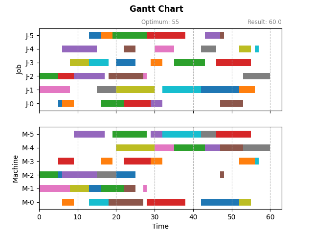

# 作业车间调度问题求解框架：Python建模

---

基于前文对作业车间调度问题的定义和描述，本文进行Python建模，开发了一个通用的作业车间调度问题求解框架，把问题分解、抽象为可重用的部分，从而专注求解算法的开发、实施和验证。

> [dothinking/jsp_framework](https://github.com/dothinking/jsp_framework)


## 框架结构

整个求解框架基于Python面向对象编程实现，主要结构参考下图。




其中，所有对象按用途可以归为三类：


### （1）物理对象

- `Job` 作业实体
- `Machine` 机器实体
- `Operation` 工序实体，包含所属作业、分配的机器、加工时长等属性


### （2）求解变量

`OperationStep`是工序实体`Operation` 的封装，同时加上待求解的参数 `start_time`。根据前文关于作业车间问题的两种不同的描述方式，相应有两种不同的求解思路：

- 对于以`start_time`为变量描述的数学模型，直接求解`start_time`即可
- 对于以 **析取图** 描述的模型，需要先求解工序的顺序，然后递推出`start_time`

因此，对于析取图描述的模型，还提供了以下中间属性：

- 继承自 `JobStep` 的 `pre_job_op` 和 `next_job_op`，分别表示当前工序在所属作业实体上的顺序：前一道工序和下一道工序；并且，它们是已知的。

- 继承自 `MachineStep` 的 `pre_machine_op` 和 `next_machine_op`，分别表示当前工序在分配机器上的加工顺序：前一道工序和下一道工序；注意这个顺序即为需要求解的变量。


### （3）求解流程

`JSProblem` 是所有工序实体 `Operation` 的封装：

- 它的解为一个`JSSolution`实例
- 每当获得一个更好的解，**需要使用`update_solution()`方法显式更新**

`JSSolution` 是所有变量 `OperationStep` 的封装：

- 对于析取图求解模型，需要显式地调用 `evaluate()` 来基于求解的顺序计算最终变量 `start_time`；基于数学模型则无需这一步。

- `is_feasible()` 判断一个解是否满足所有约束

- 如果是一个可行解，`makespan`属性得到最大加工周期长度


`JSSolver` 是作业车间调度问题求解器的基类，便于继承此基类后实施新算法。


## 实施新算法

以上的设计可以避免重复工作，从而专注于算法本身的实现和测试。基于此框架，实施新算法的只需创建自定义求解器类，然后继承 `JSSolver` 并实现 `do_solver()` 方法。`do_solver()` 方法内部主要分为三大步骤：

- 基于问题创建初始状态的解（注意并非可行的 **初始解**）

    ```python
    solution = JSSolution(problem)
    ```

- 实施算法，计算或者优化这个解

    - 对于以`start_time`为变量描述的数学模型，直接求解每个工序的`start_time`即可
    - **对于以析取图描述的模型，需要先求解工序的顺序，然后显式地调用 `solution.evaluate()` 递推出`start_time`**


- 每次迭代得到更好的解后，显式更新问题的解

    ```python
    problem.update_solution(solution)
    ```

关键代码参考：

```python
# user defined path, e.g. path/to/UserSolver.py
from jsp_fwk import (JSProblem, JSSolution, JSSolver)

class UserSolver(JSSolver):

    def do_solve(self, problem:JSProblem):
        '''User defined solving process.'''

        # (1) Initialize an empty solution from problem
        solution = JSSolution(problem)

        # (2) Solve or optimize the solution, 
        # i.e. determine the start_time of OperationStep instances.
        # Note to evaluate solution explicitly if disjunctive graph model.
        ...
        # solution.evaluate() 

        # (3) Update the solution for problem iteratively        
        problem.update_solution(solution)
```


## 测试算法

框架已经内置了作业车间调度问题的标准问题数据，便于根据名称直接初始化问题。更多基本问题数据 [参考](https://github.com/dothinking/job_shop_schedule/blob/master/benchmark/instances.json)。


### （1）单个算法单个问题

单个算法求解单个问题主要用于算法调试阶段，`solve()`方法中的两个参数：

- `interval` 以一定的频率检测和动态显示当前解的甘特图，如果设为`None`则不显示甘特图

- `callback` 在每次获得更好的解后执行自定义的动作，例如打印这个解

以下示例调用上一节自定义的求解器 `UserSolver` 求解 `ft10` 问题。


```python
# run.py
from jsp_fwk import JSProblem
from path/to/UserSolver import UserSolver

# load benchmark problem
problem = JSProblem(benchmark='ft10')

# solve problem with user defined solver
s = UserSolver()
fun = lambda solution: print(f'makespan: {solution.makespan}')
s.solve(problem=problem, interval=2000, callback=fun)
```

### （2）多个算法多个问题

当算法调试稳定后，我们需要测试它在不同规模问题上的表现，或者对比不同算法对相同问题的求解效率。针对此类场景，本框架内置了 `Benchmark` 类：排列组合输入的求解器和问题，然后进行多线程异步求解，最后对比结果。显然，`Benchmark` 类也适用于单个算法单个问题的场景。

下面例子演示了两类求解器，Google OR-Tools整数规划和规则指派算法，求解不同规模的5个问题的对比。

```python
# benchmark.py
import logging
from jsp_fwk import (JSProblem, BenchMark)
from jsp_fwk.solver import (GoogleORCPSolver, PriorityDispatchSolver)

# ----------------------------------------
# create problem from benchmark
# ----------------------------------------
names = ['ft06', 'la01', 'ft10', 'swv01', 'la38']
problems = [JSProblem(benchmark=name) for name in names]

# ----------------------------------------
# test built-in solver
# ----------------------------------------
# googl or-tools
s1 = GoogleORCPSolver(max_time=300, name='or-tools')

# priority dispatching
s2 = PriorityDispatchSolver(rule='t', name='pd-t-rule')

solvers = [s1, s2]

# ----------------------------------------
# solve and result
# ----------------------------------------
benchmark = BenchMark(problems=problems, solvers=solvers, num_threads=4)
benchmark.run(show_info=True)
```

结果示例：

```
+---------+-----------+-------+---------+----------+---------+-------+
| Problem |   Solver  | Scale | Optimum | Solution | Error % |  Time |
+---------+-----------+-------+---------+----------+---------+-------+
|   ft06  | pd-t-rule |  6x6  |    55   |   60.0   |   9.1   |  0.0  |
|   la01  | pd-t-rule |  10x5 |   666   |  666.0   |   0.0   |  0.0  |
|   ft10  | pd-t-rule | 10x10 |   930   |  1082.0  |   16.3  |  0.1  |
|   ft06  |  or-tools |  6x6  |    55   |    55    |   0.0   |  0.1  |
|  swv01  | pd-t-rule | 20x10 |   1407  |  1839.0  |   30.7  |  0.2  |
|   la01  |  or-tools |  10x5 |   666   |   666    |   0.0   |  0.4  |
|   la38  | pd-t-rule | 15x15 |   1196  |  1387.0  |   16.0  |  0.6  |
|   ft10  |  or-tools | 10x10 |   930   |   930    |   0.0   |  4.2  |
|   la38  |  or-tools | 15x15 |   1196  |   1196   |   0.0   | 141.1 |
|  swv01  |  or-tools | 20x10 |   1407  |   1414   |   0.5   | 300.1 |
+---------+-----------+-------+---------+----------+---------+-------+
```