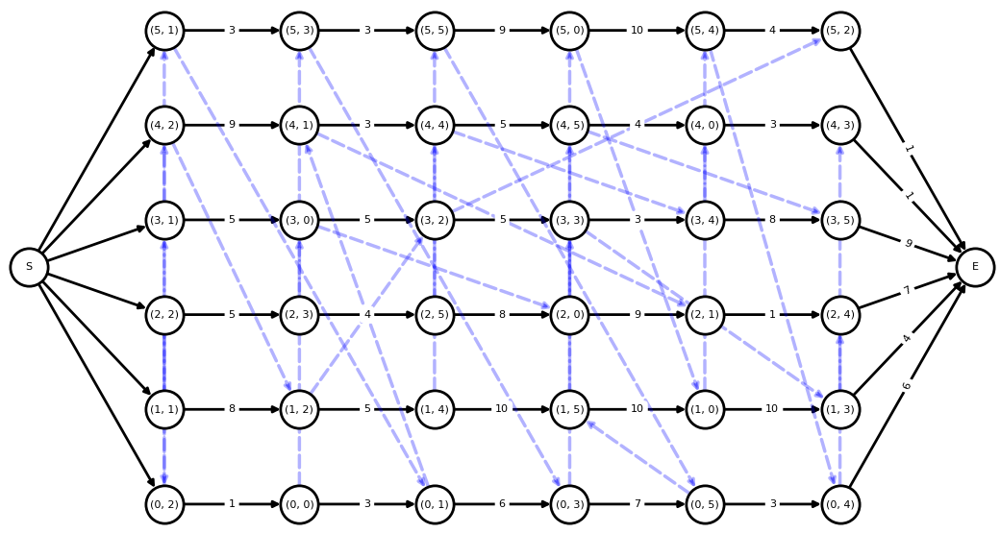

# 作业车间调度问题求解框架：Python建模

---

基于前文对作业车间调度问题的定义和描述，本文进行Python建模，开发了一个通用的作业车间调度问题求解框架，把问题分解、抽象为可重用的部分，从而专注求解算法的开发、实施和验证。

> [dothinking/jsp_framework](https://github.com/dothinking/jsp_framework)


## 框架结构

整个求解框架基于Python面向对象编程实现，主要结构参考下图。


其中，所有对象按用途可以归为三类：


### （1）物理对象

- `Job` 作业实体
- `Machine` 机器实体
- `Operation` 工序实体，包含所属作业、分配的机器、加工时长等属性
- `JSProblem` 是所有工序实体 `Operation` 的封装


### （2）求解变量

`OperationStep`是工序实体`Operation` 的封装，同时加上待求解的参数 `start_time`。根据前文关于作业车间问题的两种不同的描述方式，相应有两种不同的求解思路：

- 对于以`start_time`为变量描述的数学模型，直接求解`start_time`即可。
- 对于以 **析取图** 描述的模型，需要先求解工序的顺序，然后递推出`start_time`。

因此，对于析取图描述的模型，还提供了以下中间属性：

- `pre_job_op` 和 `next_job_op`，分别表示当前工序在所属作业实体上的顺序：前一道工序和下一道工序；并且，它们是已知的。

- `pre_machine_op` 和 `next_machine_op`，分别表示当前工序在分配机器上的加工顺序：前一道工序和下一道工序；注意这个顺序即为需要求解的变量。


### （3）求解流程

- `JSSolver` 是作业车间调度问题求解器的基类，便于继承此基类后实施新算法。

    - `problem`属性获取原始`JSProblem`实例
    - 它的解为一个`JSSolution`实例
    - 每当获得一个更好的解，**需要使用`update_solution(sol)`方法显式更新**

- `JSSolution` 是所有 `OperationStep` 的封装：

    - `is_feasible`属性判断当前解是否满足所有约束；如果是一个可行解，`makespan`属性得到最大加工周期长度。
    - 此外，还有一些后处理作图方法，例如甘特图和析取图。


## 实施新算法

以上的设计可以避免重复工作，从而专注于算法本身的实现和测试。基于此框架，实施新算法只需创建自定义求解器类，然后继承 `JSSolver` 并实现 `do_solver()` 方法。`do_solver()` 方法内部主要分为三大步骤：

- 基于问题创建初始状态的解（注意并非可行的 **初始解**）。

    ```python
    # direct_mode 指明是直接求解 start_time（True），还是以析取图模型间接求解（False）
    solution = JSSolver.init_solution(direct_mode)
    ```

- 实施算法，计算或者优化这个解。

    - 对于以`start_time`为变量描述的数学模型，直接求解并更新每个工序即可。

        ```python
        OperationStep.update_start_time(t)
        ```
    - 对于以析取图描述的模型，需要先求解工序的顺序，然后依次调度工序即可。其中，`update_time`参数指明是否及时更新工序的`start_time`。

        ```python
        JSSolution.dispatch(op_or_op_list, update_time=True)
        ```


- 每次迭代得到更好的解后，显式更新给求解器，以便触发动态甘特图的更新、自定义回调函数的调用。

    ```python
    JSSolver.update_solution(solution)
    ```

关键代码参考：

```python
# user defined path, e.g. path/to/UserSolver.py
from jsp import (JSProblem, JSSolution, JSSolver)

class UserSolver(JSSolver):

    def do_solve(self):
        """User defined solving process."""

        # (1) Initialize an empty solution and specify solving mode.
        # * direct_mode=True, solve start time directly;
        # * direct_mode=False, solve operations sequence first and deduce start time
        solution = self.init_solution(direct_mode=False)

        # (2) Solve or optimize the solution.
        for op in solution.ops:
            # option 1: solve and set start time directly
            ...
            op.update_start_time(solved_start_time)

            # option 2: solve sequence
            ...
            self.dispatch(op)

            # optional: update solution per iteration, 
            # triggering dynamic Gantt and callback
            self.update_solution(solution)

        # (3) Update solution finally
        self.update_solution(solution)
```


## 测试算法

框架已经内置了作业车间调度问题的标准问题数据，便于根据名称直接初始化问题。更多基本问题数据 [参考](https://github.com/dothinking/job_shop_schedule/blob/master/benchmark/instances.json)。


### （1）单个算法单个问题

单个算法求解单个问题主要用于算法调试阶段，`solve()`方法中的两个参数：

- `interval` 以一定的频率检测和动态显示当前解的甘特图，如果设为`None`则不显示甘特图

- `callback` 在每次获得更好的解后执行自定义的动作，例如打印这个解

以下示例调用内置的规则指派类求解器 `PriorityDispatchSolver` 求解 `ft06` 问题。因为设置了`interval`参数，优化过程中会以2秒的频率动态更新甘特图。


```python
# run.py
from jsp import JSProblem
from jsp.solver import PriorityDispatchSolver

# load benchmark problem
problem = JSProblem(benchmark='ft06')

# solve problem with user defined solver
s = PriorityDispatchSolver(problem=problem, rule='HH')
fun = lambda solution: print(f'current makespan: {solution.makespan}')
s.solve(interval=2000, callback=fun)
```


**注意**：`solve()`是在子线程中进行的异步方法，所以如果需要获取优化结果，需要通过`JSSolver.wait()`方法来等待计算完成。下面示例获取最终结果，并绘制析取图。

```python
# start solving process
s.solve(...)

# waiting
s.wait()
print('Solving time ', s.user_time)
print('Makespan ', s.solution.makespan)

# explore solution
solution = s.solution
print('feasible solution:', solution.is_feasible)
solution.plot_disjunctive_graph()
```




### （2）多个算法多个问题

当算法调试稳定后，我们需要测试它在不同规模问题上的表现，或者对比不同算法对相同问题的求解效率。针对此类场景，本框架内置了 `Benchmark` 类：排列组合输入的求解器和问题，然后进行多线程异步求解，最后对比结果。显然，`Benchmark` 类也适用于单个算法单个问题的场景。

下面例子演示了两类求解器，Google OR-Tools整数规划和规则指派算法，求解不同规模的5个问题的对比。

```python
# benchmark.py
import logging
from jsp import (JSProblem, BenchMark)
from jsp.solver import (GoogleORCPSolver, PriorityDispatchSolver)

# ----------------------------------------
# create problem from benchmark
# ----------------------------------------
names = ['ft06', 'la01', 'ft10', 'swv01', 'la38']
problems = [JSProblem(benchmark=name) for name in names]

# ----------------------------------------
# test built-in solver
# ----------------------------------------
# googl or-tools
s1 = GoogleORCPSolver(max_time=300, name='or-tools')

# priority dispatching
s2 = PriorityDispatchSolver(rule='HH', name='pd-HH')

solvers = [s1, s2]

# ----------------------------------------
# solve and result
# ----------------------------------------
benchmark = BenchMark(problems=problems, solvers=solvers, num_threads=4)
benchmark.run(show_info=True)
```

结果示例：

```
+----+---------+----------+---------------+---------+----------+---------+-------+
| ID | Problem |  Solver  | job x machine | Optimum | Solution | Error % |  Time |
+----+---------+----------+---------------+---------+----------+---------+-------+
| 1  |   ft06  | or-tools |     6 x 6     |    55   |    55    |   0.0   |  0.1  |
| 2  |   ft06  |  pd-HH   |     6 x 6     |    55   |   60.0   |   9.1   |  0.0  |
| 3  |   la01  | or-tools |     10 x 5    |   666   |   666    |   0.0   |  0.1  |
| 4  |   la01  |  pd-HH   |     10 x 5    |   666   |  666.0   |   0.0   |  0.0  |
| 5  |   ft10  | or-tools |    10 x 10    |   930   |   930    |   0.0   |  14.9 |
| 6  |   ft10  |  pd-HH   |    10 x 10    |   930   |  1082.0  |   16.3  |  0.0  |
| 7  |  swv01  | or-tools |    20 x 10    |   1407  |   1432   |   1.8   | 300.3 |
| 8  |  swv01  |  pd-HH   |    20 x 10    |   1407  |  1839.0  |   30.7  |  0.2  |
| 9  |   la38  | or-tools |    15 x 15    |   1196  |   1196   |   0.0   | 300.3 |
| 10 |   la38  |  pd-HH   |    15 x 15    |   1196  |  1387.0  |   16.0  |  0.2  |
+----+---------+----------+---------------+---------+----------+---------+-------+
```