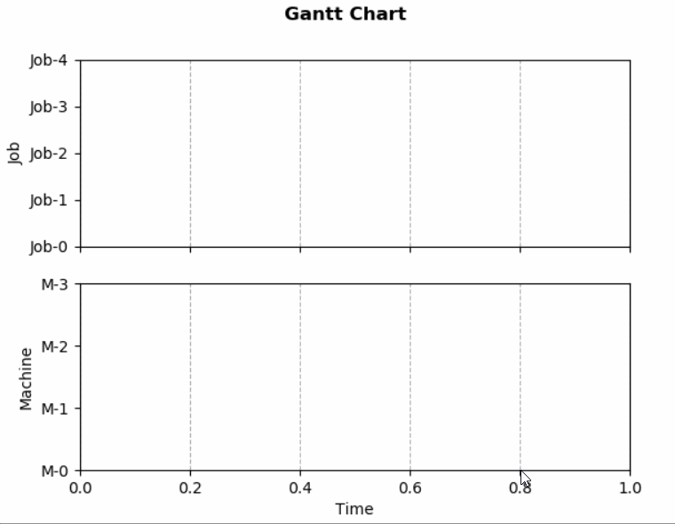
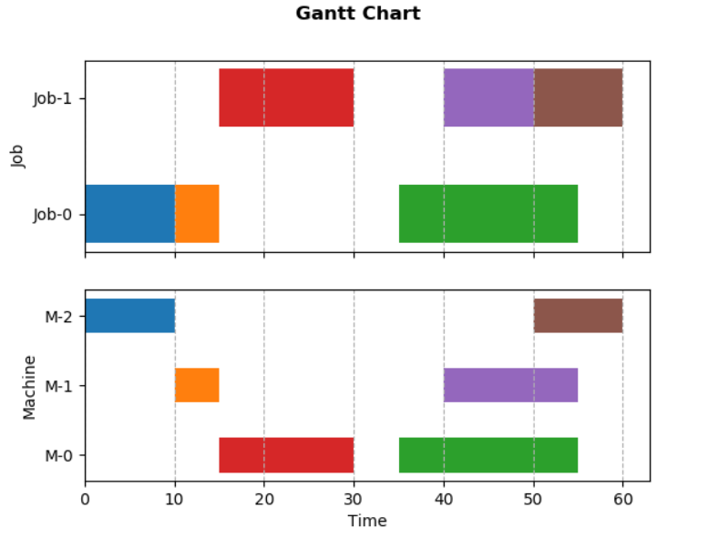

# 基于matplotlib的动态甘特图

---

本文在作业车间调度问题背景下，基于`matplotlib`库实现甘特图并监听数据进行动态更新。文中描述的基本流程也适用于其他类型图表的动态更新。最终效果如下。




## 从静态甘特图开始

甘特图可以用`matplotlib`的条形图（水平柱状图）来模拟，横轴为时间，纵轴为工序/任务类型；每一个横条(bar)对应一个工序/任务。

```python
matplotlib.pyplot.barh(y, width, height=0.8, left=None, *, align='center', **kwargs)
```

其中，

- `y`即为y轴坐标，对应 **工序类别**，例如从作业的视角即为作业ID，从机器的视角即为机器ID

- `width`为横条宽度，对应 **工序加工时间**

- `height`为横条高度，没有直接意义

- `left`为横条左边界的x坐标，对应 **工序开始时间**


通常，我们可以画出两类甘特图:

- 项目/作业视角，项目任务或者作业工序的时间安排

- 资源/设备视角，分配到同类资源/设备上的任务/工序的时间安排


本文将其绘制为同一幅图的两张子图，效果及代码如下。其中，工序属性用一个四元组表示：`（作业号，机器号，开始时间，加工时长）`。





```python
import matplotlib.pyplot as plt

# dummy data:
# - job number
# - machine number
# - task properties: (job id, machine id, start time, duration)
num_job, num_machine = 2, 3
tasks = [(0,2,0,10), (0,1,10,5), (0,0,35,20), (1,0,15,15),(1,1,40,15), (1,2,50,10)]

# create two subplots: job view and machine view
fig, (gnt_job, gnt_machine) = plt.subplots(2,1, sharex=True)

# title
fig.suptitle('Gantt Chart', fontweight='bold')

# axis style for job subplot
job_ids = range(num_job)
gnt_job.set(ylabel='Job', \
    yticks=job_ids, \
    yticklabels=[f'Job-{i}' for i in job_ids])
gnt_job.grid(which='major', axis='x', linestyle='--')

# axis style for machine subplot
machine_ids = range(num_machine)
gnt_machine.set(xlabel='Time', ylabel='Machine',\
    yticks=machine_ids, \
    yticklabels=[f'M-{i}' for i in machine_ids])
gnt_machine.grid(which='major', axis='x', linestyle='--')

# plot each task
for (jid,mid,start,duration) in tasks:
    gnt_job.barh(jid, duration, left=start, height=0.5)
    gnt_machine.barh(mid, duration, left=start, height=0.5)

plt.show()
```


## 动态更新思路

动态更新即修改绘图对象/数据，通常有以下两种做法：

- 交互绘图模式：`plt.ion`和`plt.ioff`

- 动画模式：按照一定的频率执行自定义的方法来更新数据，每一次更新数据对应 **一帧** 的结果


本文采用动画模式：

```python
matplotlib.animation.FuncAnimation(fig, func, frames=None, \
    init_func=None, fargs=None, save_count=None, *, cache_frame_data=True, **kwargs)
```

其中几个关键参数：

- `fig`为当前画布

- `func`为更新图形数据的自定义函数，参数构成如下：

    ```python
    def func(frame, *fargs) -> iterable_of_artists
    ```

    其中，

    - `frame`为每一帧的参数，由下面的`frames`参数传入
    - `fargs`为额外的参数，由下面的`fargs`传入

- `frames` 一般为可迭代对象，控制整个动画过程，每一帧传一个元素给`func`

    - 如果是可迭代对象：每一帧传一个元素
    - 如果是`int`，等效为 `range(frames)`
    - 如果是生成器，每一帧传一个生成的对象
    - 如果是`None`，每一帧传入当前运行次数

- `init_func`是图形初始化函数，在绘制第一帧前调用

    ```python
    def init_func() -> iterable_of_artists
    ```

- `fargs` 为每一帧调用时传给`func`的额外的参数

- `interval`为频率参数，表示两帧之间的间隔，默认 `200ms`

- `repeat`表示`frames`定义的帧数结束后是否重复，默认 `False`

- `blit`表示是否启用`blitting`技术优化绘图，默认 `False`

更详细介绍参考：

> https://matplotlib.org/stable/api/_as_gen/matplotlib.animation.FuncAnimation.html


!!! warning "关于`func`的进一步理解"

    - 一般在`func`中更新已经创建好的对象的数据，例如`plt.plot()`返回的曲线；也可以清除之前的所有对象，再用新的数据重新绘图，特别是对不适用直接更新数据的场合，例如本文涉及的条形图。

    - `func`的返回值（该帧所有绘图对象组成的可迭代对象）主要用于`blit=True`时优化绘图显示，所以如果设置`blit=False`，完全可以不用返回值。


## 回到作业车间调度背景

matplotlib的animation以固定的频率刷新数据，然而，回到作业车间调度问题背景下，我们无法预知在哪一刻会产生一个新解。为了避免无意义的刷新，可以设置一个开关变量，一旦得到了新解则刷新甘特图，否则啥也不做。

针对作业车间调度问题，我们抽象出两个主要的类：

- `Problem`：指定问题的规模，然后求解`solve()`，生成并动态更新甘特图`__dynamic_gantt()`

    ```python
    class Problem:
        def __init__(self, num_job:int, num_machine:int, solution) -> None:
            '''Initialize problem with the count of job and machine.'''
            self.num_job = num_job
            self.num_machine = num_machine

            # a solution is a collection of tasks with determined start time
            self.__solution = solution # type: Solution

            # implement dynamic gantt chart by animation
            self.__animation = None

        
        def solve(self):
            '''Solve problem and update Gantt chart dynamically.'''
            pass


        def __dynamic_gantt(self, interval:int=1000):
            '''Create plot and define animation to update data dynamically.'''
            pass
    ```

- `Solution`：问题的解即一系列属性已知（主要是`开始时间`）的工序，主要负责更新解`update()`和绘制甘特图的图形区域`plot()`。

    ```python
    class Solution:

        Task = namedtuple('Task',['jid','mid', 'start', 'duration'])
        
        def __init__(self) -> None:
            self.__tasks = [] # list[Task]
            self.__update_plot = False

        def update(self, num_job:int, num_machine:int):
            '''Simulate a real solving process to update solution iteratively.'''
            pass
                
        
        def plot(self, axes:tuple):
            '''Plot Gantt chart data area.'''
            pass
    ```

### 求解框架

`problem.solve()`方法模拟求解过程，主线程的甘特图持续监听新解：在获得新解之前，绘图状态为关，保持不动；一旦子线程的求解获得了更好的解，绘图选项被打开，从而更新甘特图。基本框架和相应代码如下：

- 在子线程中求解，即调用`Solution`的`update()`方法

- 在主线程中展示和更新甘特图`problem.__dynamic_gantt()`，即通过上一节介绍的`animation.FuncAnimation`对象以一定的频率执行`Solution`的`plot()`方法

```python
class Problem:
    
    def solve(self):
        '''Solve problem and update Gantt chart dynamically.'''
        # solve problem in child thread
        thread = Thread(target=self.__solution.update, \
                        args=(self.num_job, self.num_machine))
        thread.start()

        # show gantt chart and listen to the solution update in main thread
        self.__dynamic_gantt(interval=1000)
        plt.show()
```


### 定义甘特图动画

绘制甘特图的代码和第一节的静态甘特图类似，这里仅给出定义动画的部分：

- 因为无法预知动画的周期，所以`frames`参数为空，即传入调用次数`i`

- 虽然以固定频率刷新动画（调用`solution.plot()`），但实际图形在获得新解之前并不会被无意义地重复绘制（具体参考前面的介绍和下面的实现）


```python
class Problem:

    def __dynamic_gantt(self, interval:int=1000):
        '''Create plot and define animation to update data dynamically.'''
        ...

        # animation
        self.__animation = FuncAnimation(fig, \
            func=lambda i: self.__solution.plot(axes=(gnt_job, gnt_machine)), \
            interval=interval, \
            repeat=False)
```

### 更新甘特图

更新甘特图的代码如下：

- `self.__update_plot`控制了是否真正重绘

- 对于甘特图中的每一个横条，这里采用了先清除再重绘的方式


```python
class Solution:            
    
    def plot(self, axes:tuple):
        '''Plot Gantt chart data area.'''
        # update plot only if the solution is updated
        if not self.__update_plot:
            return
        else:
            self.__update_plot = False
        
        # clear plotted bars
        for axis in axes:
            bars = [bar for bar in axis.containers if isinstance(bar, BarContainer)]
            for bar in bars: bar.remove()
        
        # plot new bars
        gnt_job, gnt_machine = axes
        for task in self.__tasks:
            gnt_job.barh(task.jid, task.duration, left=task.start, height=0.5)
            gnt_machine.barh(task.mid, task.duration, left=task.start, height=0.5)
            
        # reset x-limit
        for axis in axes:
            axis.relim()
            axis.autoscale()
```


最后，完整代码参考：

> https://github.com/dothinking/dothinking.github.io/tree/master/samples/gantt
