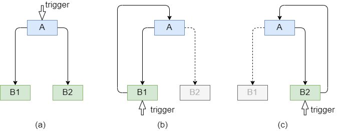
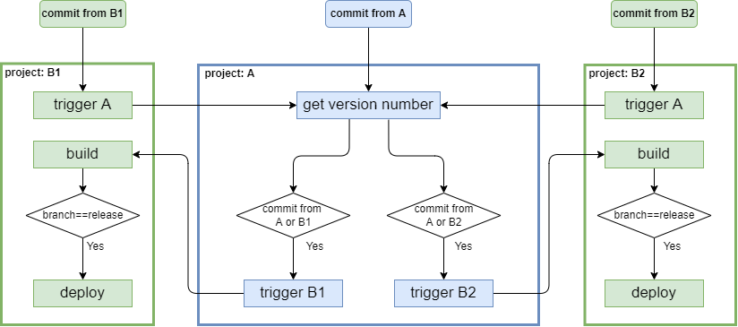
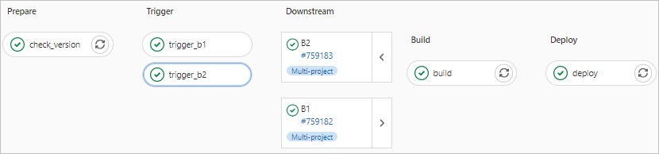
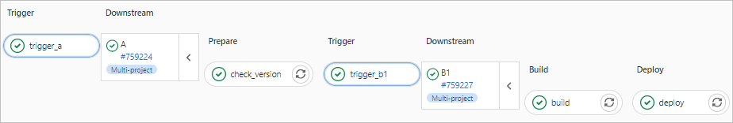

# GitLab CI CD：跨项目触发pipeline

---

近期遇到一个问题，如何灵活管理分系统的版本号和最终产品的版本号。例如，对于前后端分离且分仓库管理的Web项目，前、后端维护各自的版本号（前端1.2.3，后端1.3.4），并且发布Web产品时自动根据`tag`（1.0.0）作为产品的版本号编译到页面上。注意问题在于：**最终产品的版本号很可能与前、后端都不相同，因此通过前端或者后端仓库提交`tag`发布产品都不合适**。


## 基本思路：创建发布仓库

因此考虑新建一个发布仓库，仅维护汇总后的前后端更新日志和发布版本号。同时考虑到产品发布后的`hotfix`，也支持直接从受影响的前端或者后端仓库提交修复并部署。

综合来说，涉及两类自动化流程：

- 从发布仓库发布产品，同时触发前、后端仓库的部署，并根据提供的`tag`更新产品版本号

- 从前、后端发布`hotfix`，仅触发各自的部署，且不更新产品版本号，而是沿用发布仓库最新的`tag`

为简化表述，用`A`表示发布仓库，分别用`B1`、`B2`表示前、后端仓库，则可用下图表示以上流程。




## 具体流程

基本设定：

- 仓库`B1`和`B2`任意提交触发编译`build`，忽略测试`test`，如果是`release`分支则触发部署`deploy`

- 仓库`A`仅在提交`tag`后触发流程

考虑到模块化和就近原则，仓库`A`负责获取当前最新的`tag`作为产品版本号，仓库`B1`、`B2`负责各自的编译和发布，只不过编译前需要拿到产品版本号。参考下图具体流程：

- 如果从仓库`A`提交`tag`触发流程，则直接获取最新版本号，然后分别触发仓库`B1`和`B2`的流程。

    以`B1`为例，注意此时直接到`build`这个任务；`B2`同理，不再赘述。

- 如果从仓库`B1`提交，由于编译前需要获取产品当前版本号，因此通过`trigger A`任务触发仓库`A`的流程。

    类似上文所述`A`的流程，只不过此时需要根据原始仓库（即`B1`）确定只触发`B1`的流程，进而来到`B1`的`build`。




## 最终效果

借助 GitLab CI/CD 的基本功能，执行效果参考下图，可见完整实现了上述流程。

- 从`A`发布版本`1.1.0`




- 从`B1`的`release`分支提交`hotfix`




## 实现细节

总结几个关键点：

- 跨项目触发流程，例如上图中`B1`中`trigger A`和`A`中`trigger B1`、`trigger B2`

- 执行任务的时机，例如`B1`中`trigger A`仅在直接提交时执行，而`build`仅当从上游流水`pipeline`触发时执行。

- 跨项目触发流程时传递参数，例如通过`B1`的`trigger A`进入`A`的流程时，传递表明原始仓库即`B1`的参数，以便选择性进入`trigger B1`


### 跨项目触发流程

这是本文的基础，具体说明参考官方文档 [Multi-project pipelines](https://docs.gitlab.com/ee/ci/pipelines/multi_project_pipelines.html)。


```yml
downstream-job:
  variables:
    UPSTREAM_BRANCH: $CI_COMMIT_REF_NAME
  trigger:
    project: path/to/downstream/project
    branch: stable-11-2
```

- `trigger`关键字指定将要触发的下游项目的具体路径，同时可以指定基于的分支`branch`

    如果忽略分支即默认最新分支，则可以合并为`trigger: path/to/downstream/project`

- `variables`关键字将当前流程的参数传递到下游流程的每个任务中去，例如此处`$CI_COMMIT_REF_NAME`表示当前分支名

    更多内置参数参考 [Predefined CI/CD variables](https://docs.gitlab.com/ee/ci/variables/predefined_variables.html)


!!! note "注意："
    `trigger:project`不支持变量输入，`trigger:branch`支持变量输入。


### 任务执行条件

GitLab CI/CD通过 [`only / except`](https://docs.gitlab.com/ee/ci/yaml/index.html#only--except) 和 [`rules`](https://docs.gitlab.com/ee/ci/yaml/index.html#rules) 关键字，以非常灵活的方式将任务加入或者排除当前流程。

本文相关的几个例子：

- 从上游仓库触发`B1`不执行`trigger A`

    ```yml
    trigger_a:
        stage: trigger
        trigger: path/to/A
        except:
            - pipelines
    ```

- 当且仅当从上游仓库触发`B1`时才执行`build`

    ```yml
    build:
        stage: build
        script:
            - ...
        only:
            - pipelines
    ```

- 从上游仓库触发`B1`且当前分支是`release`时才执行`deploy`

    ```yml
    deploy:
        stage: deploy
        script:
            - echo "Deploying application only if branch=release..."
        rules: 
            - if: $CI_PIPELINE_SOURCE=="pipeline" && $SOURCE_BRANCH=="release"

    ```

    其中，`CI_PIPELINE_SOURCE`也是默认CI/CD参数，表示流程的触发源，值`pipeline`表明从上游流程触发而来；`SOURCE_BRANCH`也是从上游流程传递过来的表明当前分支的自定义参数。

- `A`中`get version number`任务只有在`tag`提交或者从其他流程触发而来才执行

    ```yml
    get_version_number:
        stage: prepare
        script:
            - ...
        only:
            - /^([0-9]+)\.([0-9]+)\.([0-9]+)$/
            - pipelines
    ```

- `A`中`trigger B1`任务满足以下两种情形之一即可执行：

    - 直接从`A`仓库`tag`提交

    - 从其他流程触发且自定义参数`SOURCE_PROJECT`的值等于`B1`即从`B1`触发的流程


    ```yml
    trigger_b1:
        stage: trigger
        trigger: 
            project: path/to/B1
            branch: $TARGET_BRANCH
        rules: 
            - if: $CI_COMMIT_TAG =~ /^([0-9]+)\.([0-9]+)\.([0-9]+)$/
            - if: $CI_PIPELINE_SOURCE=="pipeline" && $SOURCE_PROJECT=="B1"
    ```


## 完整`ymal`文件

补充一点：本例的产品版本号是通过保存文件的形式在两个流程间传递的，因此需要保证各流程都在同一台gitlab-runner上执行。而这，可以通过设定相同的`tags`来实现。

最后，分别列出各仓库的ymal文件。

```yml
# .gitlab-ci.yml for project A

variables:
  PROJECT_B1: "B1"
  PROJECT_B2: "B2"
  VERSION_FILE: /tmp/version
  TARGET_BRANCH: "release"

stages:
  - prepare
  - trigger

check_version:
  stage: prepare
  script:
    - VERSION=$(git describe --tags $(git rev-list --tags --max-count=1))  # recent tag
    - if [ "$VERSION" = "" ]; then VERSION="1.0.0"; fi
    - VERSION="$VERSION.$(date +%Y%m%d)"
    - echo $VERSION>$VERSION_FILE
  only:
    - /^([0-9]+)\.([0-9]+)\.([0-9]+)$/
    - pipelines
  tags:
    - shell_runner


trigger_b1:
  stage: trigger
  variables:
    SOURCE_BRANCH: $TARGET_BRANCH
  trigger: 
    project: path/to/B1
    branch: $TARGET_BRANCH
  rules: 
    - if: $CI_COMMIT_TAG =~ /^([0-9]+)\.([0-9]+)\.([0-9]+)$/
    - if: $CI_PIPELINE_SOURCE=="pipeline" && $SOURCE_PROJECT==$PROJECT_B1


trigger_b2:
  stage: trigger
  variables:
    SOURCE_BRANCH: $TARGET_BRANCH
  trigger: 
    project: path/to/B2
    branch: $TARGET_BRANCH
  rules: 
    - if: $CI_COMMIT_TAG =~ /^([0-9]+)\.([0-9]+)\.([0-9]+)$/
    - if: $CI_PIPELINE_SOURCE=="pipeline" && $SOURCE_PROJECT==$PROJECT_B2
```

```yml
# .gitlab-ci.yml for project B1; same with B2

stages:
  - trigger
  - build
  - deploy

trigger_a:
    variables:  
      SOURCE_PROJECT: $CI_PROJECT_NAME
      TARGET_BRANCH: $CI_COMMIT_REF_NAME
    stage: trigger
    trigger: path/to/A
    except:
      - pipelines


build:
  stage: build
  script:
    - VERSION=$(cat $VERSION_FILE)
    - echo $VERSION
  only:
    - pipelines
  tags:
    - shell_runner


deploy:
  stage: deploy
  script:
    - echo "Deploying application only if branch=release..."
  rules: 
    - if: $CI_PIPELINE_SOURCE=="pipeline" && $SOURCE_BRANCH=="release"
  tags:
    - shell_runner
```