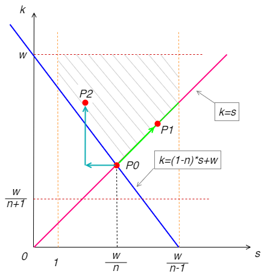

# 空间金字塔池化（SPP）关键参数计算

---

空间金字塔池化（Spatial Pyramid Pooling）方法关联了不定尺寸输出的卷积层和固定大小的全连接层，一方面可以适应不同尺寸图片输入，避免了统一图片大小的前处理操作；另一方面可以提取不同尺寸的空间特征信息，进而提升模型对于空间布局和物体变形的鲁棒性。SPP的基本原理请参考[原论文](https://arxiv.org/abs/1406.4729)或[相关解读](https://zhuanlan.zhihu.com/p/64510297)，本文基于输入输出尺寸，分析SPP关键参数例如窗口尺寸（kernel）、步长（stride）及边距（padding）的计算方法。

## 问题提出

已知卷积后输出尺寸 $(w, h)$，空间金字塔池化后目标输出 $(n_w, n_h)$，计算池化层的窗口尺寸$(k_w, k_h)$，步长$(s_w, s_h)$及边距$(p_w, p_h)$。为了简化描述，以下仅基于其中一个维度计算，另一维度采用完全相同的计算公式。因此，相应参数简化为：

**已知输入、输出尺寸$w$和$n$，求池化窗口尺寸$(k)$，步长$(s)$及边距$(p)$**。

如果正向计算，公式为：

$$
n = \left \lfloor \frac {w+2p-k} {s} \right \rfloor + 1
\tag{1}
$$

其中 $\lfloor x \rfloor$ 表示对$x$向下取整，例如 $\lfloor 1.5 \rfloor = 1$，同理向上取整符号及例子：$\lceil 1.5 \rceil = 2$。

## 原始论文公式

[原论文](https://arxiv.org/abs/1406.4729)中的计算公式：

$$
k = \left \lceil \frac {w} {n} \right \rceil, 
\quad 
s = \left \lfloor \frac {w} {n} \right \rfloor, 
\quad
p = 0
\tag{2}
$$

有些解读论文的博文指出了问题及反例：

取 $w=7, n=4$，根据公式（2）得出 $k=2,s=1,p=0$，

然而将池化参数带入公式（1）却得出矛盾的结果：$n=5$！

!!! warning "注意："
    这是作者为论文中特定场景提出的，确实并不具备（作者也没声明）通用性。

## 初步修正的公式

参考[博文](https://www.cnblogs.com/marsggbo/p/8572846.html)，给出了如下通用性更好的公式：

$$
k = s = \left \lceil \frac {w} {n} \right \rceil \\\\
p = \left \lfloor \frac {k*n-w+1} {2} \right \rfloor 
\tag{3}
$$

对上一个例子 $w=7, n=4$，根据公式（3）可以得出正确结果： $k=2,s=2,p=1$。

但还是可以找到有问题的例子：

取 $w=5, n=4$，根据公式（3）得出 $k=2,s=2,p=2$，

带入公式（1）验证没问题，但是 **pytorch要求 padding 不超过 kernel 的一半** 即 $k >= 2p$，显然此处不满足。

## 可行域分析

为了方便分析这个问题，先排除两种特殊情况：

- 当 $n>w$ 时，不符合SPP的物理意义

- 当 $n=1$ 即输出为1时，取窗口正好为输入尺寸：$k=w, s=1, p=0$

于是在 $w \geq n \gt 1$ 条件下，列出以下限制条件/不等式：

$$
(n-1)*s+k-w \leq 2p \lt n*s+k-w
\tag{4-1}
$$

$$
0 \leq 2p \leq k
\tag{4-2}
$$

$$
1 \leq s \leq k \leq w
\tag{4-3}
$$

$$
(n-1)*s+k \geq w + p
\tag{4-4}
$$

其中，

- 不等式（4-1）直接从等式（1）去掉取整符号得到；
- 不等式（4-2）避免引入过多无意义的边距信息，也是 pytorch 中的一个限制；
- 不等式（4-3）要求步长不大于窗口大小，否则跳过了有效区域；
- 不等式（4-4）左边表示池化操作的实际作用范围，右边表示特征图的有效位置，因此整个式子要求池化操作覆盖所有有效区域。

将不等式（4-1）左半部分取整得到 $p$ 的计算公式：

$$
p = \left \lceil \frac {(n-1)*s + k - w} {2} \right \rceil 
\tag{5}
$$

代入 $k=s$，公式（5）退化为公式（3）计算 $p$ 的部分，表明它是公式（5）更具一般性，公式（3）的 $p$ 只是一个特例。

结合（4-1）左半部分和（4-2）右半部分：

$$
k \geq 2p \geq (n-1)*s+k-w => s \leq \frac {w} {n-1}
$$

结合（4-1）右半部分和（4-3）：

$$
0 \leq 2p \lt n*s+k-w \leq n*k+k-w => k \gt \frac {w} {n+1}
$$

不等式（4-4）缩放一下去掉 $p$：

$$
(n-1)*s+k \geq w
$$

综合得到：

$$
\begin{cases}
    1 \leq s \leq \frac {w} {n-1} \\\\
    \frac {w} {n+1} \lt k \leq w \\\\
    k \geq s \\\\
    k \geq (1-n)*s + w
\end{cases}
\tag{6}
$$

注意各个参数都是非负整数，但此刻先不做区分，直接线性规划求解可行域，得到下图。

显然，解可能不唯一。我们先得到一个特征点 $P_0(w/n, w/n)$，然后基于不同的策略有不同的选择：

- 如果沿着绿色箭头方向往 $P_1$ 方向走，窗口大小始终与步长相等，即传统的池化模式。

- 如果沿着青色箭头方向往 $P_2$方向走，窗口大小始终大于步长，即带重叠模式的池化。

以 $P_1$ 方向为例，因为 $k,s$ 都是正整数，我们取 $P_0$ 右侧最接近的正整数值，即 $k = s = \lceil w / n \rceil$ ，于是得到了网上常见的初步修正的公式，即上文的公式（3）。

至此，可以解释和统一之前的计算方法。

### 公式（3）在什么情况下不再适用？

对照可行域图就很好解释了——绿色线段上可能不存在整数解。

例如例子中 $w=5,n=4$，绿色线段两个端点的 $s$ 坐标分别为 1.25 和 1.667，二者之间并不存在正整数。

那么，公式（3）在什么条件下才适用呢？令 $w=a*n+b$，其中 $0 \leq b \lt n$，则

$$
\frac {w} {n-1} = \frac {a*n+b} {n-1} = a + \frac {a+b} {n-1}
$$

显然，$w/(n-1)$ 的整数部分至少达到 $a+1$ 即 $(a+b)/(n-1) \geq 1$ 时，绿色线段标注的可行域上才有整数解。因此，公式（3）的使用条件：

$$
\left \lfloor \frac {w} {n} \right \rfloor + \left(w \mod n\right) + 1 \geq n
\tag{7}
$$

### 如何处理公式（3）不适用的情况？

当 $w,n$ 不满足不等式（7）时，公式（3）失效，那就走 $P_2$ 的路线，如青色箭头所示：

- 此种情况下往右显然不存在可行的$s$了，于是向左一步得到 $P_0$ 附近的 $s$；

- 然后向上增大 $k$ 知道满足可行域要求。

以上过程反映了公式（2）的思路，但是为了更具通用性，确定 $k$ 时需要检查是否落在可行域内。将公式（2）中 $s$ 的表达式代入（4-4）的缩放式得到 $k$，然后将 $k,s$ 代入公式（5）计算 $p$，最终得到公式（2）的更一般形式：

$$
s = \left \lfloor \frac {w} {n} \right \rfloor,
\quad
k = w - (n-1)*s,
\quad
p = 0
\tag{8}
$$

回到 $w=5,n=4$ 的例子，代入上式得到 $k=2, s=1, p=0$，满足所有约束。

!!! warning "注意："
    上式和公式（2）的最直接区别是 $k$ 的计算方法。公式（2）在定义 $k,s$ 的同时强行设定 $p=0$（或者说忽略了 $p$ 的计算），实际上三者是相互关联的。公式（8）通过构造 $k$，使 $p=0$ 自然得到满足。

## 完整算法

适用条件：$w \geq n \gt 1$，不满足此条件时，参考上文例外描述。
特别说明：以下算法优先选择传统非重叠的池化方式，只有在无法满足时，才考虑重叠的池化方式。如果倾向于重叠的池化方式，则直接进入第（2）部分即可。

（1）当 $\lfloor w/n \rfloor + \left(w \mod n\right) + 1 \geq n$ 时，

$$
s = k = \left \lceil \frac {w} {n} \right \rceil,
\quad
p = \left \lceil \frac {n*k - w} {2} \right \rceil 
$$

（2）$\lfloor w/n \rfloor + \left(w \mod n\right) + 1 \lt n$ 时，

$$
s = \left \lfloor \frac {w} {n} \right \rfloor,
\quad
k = w - (n-1)*s,
\quad
p = 0
$$

