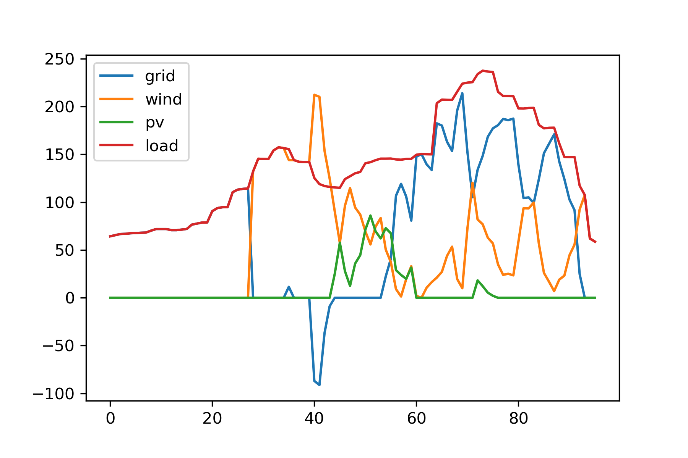
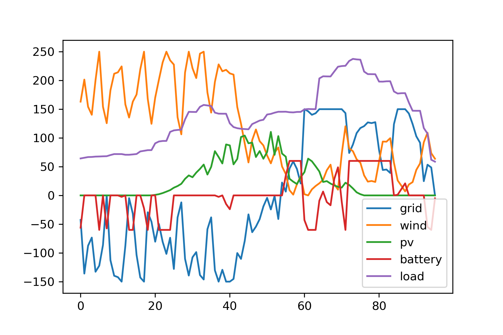
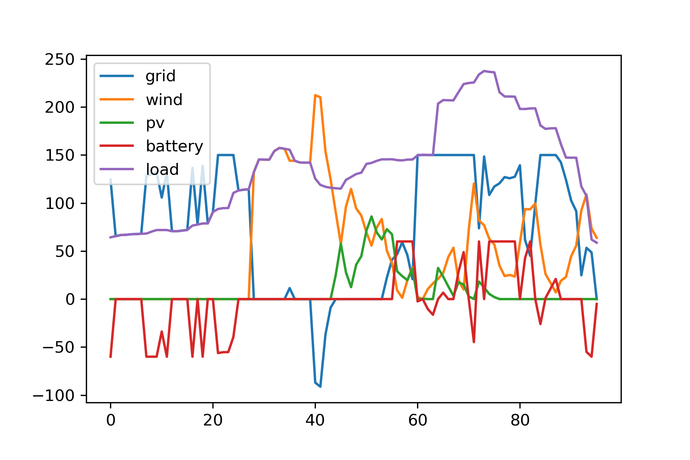

# 微电网日前优化调度入门：求解一道数学建模题


---

最近看了一些微电网优化调度的论文，苦于无从下手之际，看到一道微电网日前优化调度相关的数学建模题；题目提供了一个简单的风光储微电网场景及测试数据，正好拿来练手。本文基于Python第三方库`PuLP`实现题目的混合整数规划模型，并使用默认的`CBC`求解器求解。输入数据及汇总代码，参见文末。

## 问题描述

问题出自第十届“中国电机工程学会杯”全国大学生电工数学建模竞赛A题：微电网日前优化调度。

下图示意了一个含有风机、光伏、蓄电池及常见负荷的微电网系统。日前经济调度问题是指在对风机出力、光伏出力、常规负荷进行日前（未来24h）预测的基础上，考虑电网测的分时电价，充分利用微网中的蓄电池等可调控手段，使微电网运行的经济性最优。


题目要求在如下已知条件下，求不同调度方案的平均用电成本：

- 未来24h、每隔15min共96个时间点的负荷、光伏、风机出力预测，及分时电价数据；

- 风机容量250kW，发电成本0.52元/kWh；

- 光伏容量150kW，发电成本0.75元/kWh；

- 蓄电池容量300kWh；SOC初始值0.4，运行范围[0.3, 0.95]；由充电至放电成为为0.2元/kWh；日充放电次数限制均为8；忽略蓄电池损耗；

完整问题描述参考：

- [第十届“中国电机工程学会杯”全国大学生电工数学建模竞赛 A 题：微电网日前优化调度](https://blog.csdn.net/Jian_Yun_Rui/article/details/72529176)
- [微电网日前优化调度 。算例有代码（0）](https://blog.csdn.net/kobeyu652453/article/details/106497232)


## 风光储优化调度模型

题目涉及电网、新能源（风机、光伏）、蓄电池及负荷四类资源，我们依次建立其线性规划模型，然后交给求解器求解。一个线性规划模型包含：

- 设计变量：各类资源的实时出力数据
- 约束条件：能量平衡及各类资源应该满足的技术参数，例如蓄电池的容量限制、SOC限制、充放电次数限制等
- 目标函数：运行成本，具体到本题即用电成本

本文基于 Python 第三方库`PuLP`实现。`PuLP`是一个线性规划问题建模库，将数学模型转换为 MPS 或者 LP 文件，然后调用 LP 求解器如 CBC、GLPK、CPLEX、Gurobi 等求解。具体用法参考下面链接，本文不再赘述。

- [PuLP Documentation](https://coin-or.github.io/pulp/)
- [Python求解线性规划——PuLP使用教程](https://www.cnblogs.com/OnlyAR/p/16196469.html)


开始之前先抽象一个模型基类，表示各类调度设备，包含名称、容量、使用成本等基本属性，同时提供一个`create_model()`方法，用于实现设计变量、约束条件、目标函数等线性规划模型三要素。模型求解后，调用`output`属性获取变量值，即每个时刻的出力。

```python
import pulp
import numpy as np


class Model:
    def __init__(self, name:str, 
                        capacity:float,         # resource capacity
                        unit_cost:float):       # unit cost when using the energy
        '''Base class for resource model, e.g., Grid, Renewable and Storage.'''
        # technical parameters
        self.name = name
        self.capacity = capacity
        self.unit_cost = unit_cost

        # linear programming model: variables, constraints and objective
        self.variables = None
        self.constraints = None
        self.objective = None

    def create_model(self, time_points:int, dt:float):
        '''How to create the LP model.'''
        raise NotImplementedError
    
    @property
    def output(self): return np.array([v.value() for v in self.variables])
```


接下来依次建立电网、新能源（风机、光伏）及蓄电池的模型。


### (1) 电网模型

电网模型继承自`Model`基类，同时新增了**卖电收益**属性，并且满足容量约束即每个时刻的出力不能超过限定值，目标函数为运行成本即用电费用与卖电收益的差值。

直观地，任意时刻可以用一个变量 $p^i$ 来表示电网的出力：正值表示从电网买电，或者负值表示卖电给电网。但是，**事先并不知道 $p^i$ 的正负**，也就没法计算此刻的运行成本（不能将线性规划变量直接用于`if-else`语句中）。因此，引入买电、卖电两个中间变量来分开描述：

- $p^i_f \geq 0$ 表示 $i$ 时刻从电网买电量；
- $p^i_t \geq 0$ 表示 $i$ 时刻向电网卖电量；

因为同一时刻电流只能单向流动，即 $p^i_f$ 和 $p^i_t$ 至少有一个等于0：$p^i_f * p^i_t=0$。

但这并不是一个合法的线性约束，需要再引入一个`0-1`变量：

- $b_i=\{0，1\}$：1 表示从电网买电即 $p^i_t=0$，0 表示卖电到电网即 $p^i_f=0$

于是线性约束表示为：

$$
0 \leq p^i_f \leq b^i * C \\
0 \leq p^i_t \leq (1-b^i) * C \\
$$

其中，$C$为电网容量（交换功率）限制值。

最终，电网 $i$ 时刻实际出力 $p^i$ 及用电成本（买电或卖电）$c^i$：

$$
p^i = p^i_f - p^i_t \\
c^i = p^i_f * u_1 * dt - p^i_t * u_2 * dt
$$

其中，$u_1,u_2$分别为该时刻单位买电成本、卖电收益（元/kWh），$dt$ 为时间步长。

```python
class Grid(Model):
    def __init__(self, name:str, 
                    capacity:float, 
                    unit_cost:np.ndarray,    # unit cost when buying electricity from utility grid
                    unit_profit:np.ndarray): # unit profit when selling electricity to utility grid
        super().__init__(name, capacity, unit_cost)
        self.unit_profit = unit_profit


    def create_model(self, time_points:int, dt:float):
        # define variables at each time point
        vars_from = [pulp.LpVariable(name=f'{self.name}_from_{i}', lowBound=0) for i in range(time_points)]
        vars_to = [pulp.LpVariable(name=f'{self.name}_to_{i}', lowBound=0) for i in range(time_points)]
        self.variables = [v1-v2 for v1,v2 in zip(vars_from, vars_to)]

        # constraints: capacity limit
        # 0<=var_from<=C*b
        # 0<=var_to<=C*(1-b)
        self.constraints = []
        vars_b = [pulp.LpVariable(name=f'{self.name}_binary_{i}', cat=pulp.LpInteger) for i in range(time_points)]
        for v1,v2,b in zip(vars_from, vars_to, vars_b):
            self.constraints.append(v1<=self.capacity*b)
            self.constraints.append(v2<=self.capacity*(1-b))
        
        # objective
        self.objective = pulp.lpSum([v*x for v,x in zip(vars_from, self.unit_cost)])*dt - \
            pulp.lpSum([v*x for v,x in zip(vars_to, self.unit_profit)])*dt
```


### (2) 新能源发电模型

将风机和光伏抽象为新能源发电模型，约束条件为**每一时刻的电力供应不大于预测出力，如果不允许弃风弃光的话，则等于预测出力值**。因此，在`Model`类基础上增加两个输入参数：

- `forecast`：每一时刻的出力预测，即一个列向量/数组/时间序列；
- `allow_curtailment`：是否允许弃风弃光，默认允许。

相应地，提供一个`utilization`输出属性表示新能源发电的实际利用率。

```python
class Renewable(Model):
    def __init__(self, name:str, 
                    capacity:float,
                    unit_cost:float,
                    forecast:np.ndarray,          # forecasting output
                    allow_curtailment:bool=True): # allow curtailment or not
        super().__init__(name, capacity, unit_cost)
        self.forecast = forecast
        self.allow_curtailment = allow_curtailment

    def create_model(self, time_points:int, dt:float):
        # define variables at each time point
        self.variables = [pulp.LpVariable(name=f'{self.name}_{i}', lowBound=0) for i in range(time_points)]

        # constraints:  v<=forecast       
        if self.allow_curtailment:
            self.constraints = [v<=x for v,x in zip(self.variables, self.forecast)]
        else:
            self.constraints = [v==x for v,x in zip(self.variables, self.forecast)]
        
        # objective
        self.objective = pulp.lpSum(self.variables)*self.unit_cost*dt

    @property
    def utilization(self): return self.output.sum() / self.forecast.sum()
```


### (3) 蓄电池模型

原题已经给出了蓄电池的混合整数规划数学模型，除了基类中的容量、单位用电成本外，还有如下主要参数：

- `capacity_limit`：爬坡限制值，即原题公式（5）中的数值 20%
- `init_soc`：初始SOC状态
- `soc_limit`：电量范围SOC限制
- `cycle_limit`：充放电次数限制

参考原题的约束：

- 爬坡约束：公式（3）（5）
- 容量约束：公式（1）（2）
- 调度周期始末电量相等：公式（4）
- 充放电次数约束：公式（6）

类比上文对电网买电、卖电行为的建模，同一时刻也需要三个中间变量：充电功率 $p^i_c$、放电功率 $p^i_d$、充放电`0-1`状态 $b^i$ （1-放电，0-充电）来描述电池的出力。前三个约束的实现不再赘述，下面重点解析充放电次数约束。

充放电状态序列 $b=\{b^1, b^2, ..., b^n\}$，引入辅助的`0-1`变量 $t$ 表示相邻状态相减的绝对值，即

$$
t^i = |b^{i+1} - b^i| \quad 1=1,2,3,...,n-1
$$

当 $t^i=1$ 时，即相邻的充放电状态由0变成了1，或者由1变成了0，表示完成了一次充放电周期。于是总的充放电次数限制约束可以表示为：

$$
\Sigma t^i \leq N_c
$$

至此还剩最后一个问题，如何将含有绝对值的等式 $t^i = |b^{i+1} - b^i|$ 变换为线性约束？

结合本文场景，将等式松弛一下 $t^i \geq |b^{i+1} - b^i|$：

- $t^i=1$ 正是我们需要计数的情况
- $t^i=0$ 没有增加计数，此时 $b^{i+1} = b^i$ 表明并未发生充放电状态变化，恰好可以对应上

于是，上述绝对值等式约束等效为：

$$
-t^i \leq b^{i+1} - b^i \leq t^i
$$


```python
class Storage(Model):
    def __init__(self, name:str, 
                    capacity:float, 
                    unit_cost:float,
                    capacity_limit:float, # charging / discharging ramping limit
                    init_soc:float,       # initial state of charge
                    soc_limit:list,       # SOC limit
                    cycle_limit:int):     # charing / discharging cycle counts limit
        super().__init__(name, capacity, unit_cost)
        self.init_soc = init_soc
        self.soc_limit = soc_limit
        self.cycle_limit = cycle_limit
        self.capacity_limit = capacity_limit
    
    def create_model(self, time_points: int, dt: float):
        # define variables at each time point
        vars_ch = [pulp.LpVariable(name=f'{self.name}_charge_{i}', lowBound=0) for i in range(time_points)]
        vars_dis = [pulp.LpVariable(name=f'{self.name}_discharge_{i}', lowBound=0) for i in range(time_points)]
        self.variables = [v1-v2 for v1,v2 in zip(vars_dis, vars_ch)]

        # constraints 1: ramping limit
        # 0<=var_dis<=C*b
        # 0<=var_ch<=C*(1-b)
        self.constraints = []
        vars_b = [pulp.LpVariable(name=f'{self.name}_binary_{i}', cat=pulp.LpInteger) for i in range(time_points)]
        C = self.capacity * self.capacity_limit
        for v1,v2,b in zip(vars_dis, vars_ch, vars_b):
            self.constraints.append(v1<=C*b)
            self.constraints.append(v2<=C*(1-b))
        
        # constraints 2: SOC limit
        soc = self.init_soc
        s1, s2 = self.soc_limit
        for v1,v2 in zip(vars_ch, vars_dis):
            soc += (v1*dt - v2*dt) / self.capacity
            self.constraints.append(soc>=s1)
            self.constraints.append(soc<=s2)
        
        # constraints 3: same SOC at the scheduling end
        self.constraints.append(pulp.lpSum(self.variables)==0)

        # constraints 4: charging / discharging cycle limit
        # t = |b_i-b_{i+1}|
        # sum(t)<=N
        vars_db = [vars_b[i+1]-vars_b[i] for i in range(time_points-1)]
        vars_t = [pulp.LpVariable(name=f'{self.name}_binary_t_{i}', cat=pulp.LpInteger) for i in range(time_points-1)]
        for db, t in zip(vars_db, vars_t):
            self.constraints.append(db>=-t)
            self.constraints.append(db<=t)
        self.constraints.append(pulp.lpSum(vars_t)<=self.cycle_limit)

        # objective
        self.objective = pulp.lpSum(vars_dis)*self.unit_cost*dt
```


### (4) 风光储优化调度模型

最后，我们抽象出一个微电网类，包含上述能源设备`resources`及负荷`load`，同时引入系统能量平衡约束，建立最终的优化模型。其中的几个方法：

- `optimize()`：建模和求解过程    
- `operation_cost`：目标函数值即总用电费用
- `average_cost`：平均用电成本

```python
import matplotlib.pyplot as plt


class MicroGrid:
    def __init__(self, resources:list, load:np.ndarray, time_step:float) -> None:
        self.resources = resources
        self.load = load
        self.time_step = time_step

        # create problem: minimize the operation cost
        self.prob = pulp.LpProblem(name='microgrid_optimization', sense=pulp.LpMinimize)
    
    @property
    def operation_cost(self): return self.prob.objective.value()

    @property
    def average_cost(self): return self.operation_cost / (self.load.sum()*self.time_step)

    def optimize(self):
        '''Micro-grid operation optimization.'''
        # collect resources models
        d_variables, constraints, objective = [], [], 0.0
        time_points = self.load.size
        for resource in self.resources:
            resource.create_model(time_points, self.time_step)
            d_variables.append(resource.variables)
            constraints.extend(resource.constraints)
            objective += resource.objective
        
        # add constraints: resource level
        for c in constraints: self.prob += c

        # add constraint: energy balance
        for i in range(time_points):
            _vars = [variables[i] for variables in d_variables]
            self.prob += pulp.lpSum(_vars)==self.load[i]
        
        # objective
        self.prob += objective

        # solve
        self.prob.solve()

        # output
        self._summary() 

    def _summary(self):
        print(f'Status: {pulp.LpStatus[self.prob.status]}')
        print(f'全天总供电费用：{round(self.operation_cost,4)} 元，负荷平均购电单价：{round(self.average_cost,4)} 元/kWh')        
        # plot
        for r in self.resources: plt.plot(r.output, label=r.name)
        plt.plot(self.load, label='load')
        plt.legend()
```

## 求解典型场景

本节根据上文建立的优化调度模型，求解提问中的不同调度策略。

先导入全天96个时刻的时间序列数据：

```python
# read text to list
with open('input.csv', 'r', encoding='utf-8') as f: lines = f.readlines()

# print the first three lines for example
for line in lines[:3]: print(line)

# list to numpy 2D array
data = [list(map(float, line.split(','))) for line in lines[1:]] # except the header line
data = np.array(data)

data_load, data_wt, data_pv, unit_profit, unit_cost = [data[:, i] for i in range(1,6)]

# output:
# 序号,负荷(kW),风机(kW),光伏(kW),售电(元/kWh),购电(元/kWh)
# 1,64.3,163.1,0,0.22,0.25
# 2,65.5,201.47,0,0.22,0.25
```


### (1) 经济性评估方案

> 问题：微网中蓄电池不作用，微网与电网交换功率无约束，无可再生能源情况下，分别计算各时段负荷的供电构成（kW）、全天总供电费用(元)和负荷平均购电单价（元/kWh）。

这一问不用优化模型也能解，多余的电卖给电网、不足的电从电网购买即可，参考[这篇文章](https://blog.csdn.net/kobeyu652453/article/details/106497539)的解析过程。但既然我们已经建立了统一的优化调度模型，本例只要引入电网一种资源，将其作为一个特例直接求解即可。

因为电网交换功率没有限制，直接设一个较大的数例如$10^6$即可。

```python
# set a large value 1e6 as no limit on energy exchanging with grid
grid = Grid(name='grid', capacity=1e6, unit_cost=unit_cost, unit_profit=unit_profit) 

# microgrid
resources = [grid]
mg = MicroGrid(resources=resources, load=data_load, time_step=15/60) # 15min
mg.optimize()
```

输出：

```
Status: Optimal
全天总供电费用：1976.4142 元，负荷平均购电单价：0.5976 元/kWh
```


> 问题：微网中蓄电池不作用，微网与电网交换功率无约束，可再生能源全额利用情况下，分别计算各时段负荷的供电构成（kW）、全天总供电费用(元)和负荷平均购电单价（元/kWh）。

这一问将风机和光伏加入微网，同时注意设置不可弃风弃光（可再生能源全额利用）。

```python
# set a large value 1e6 as no limit on energy exchanging with grid
grid = Grid(name='grid', capacity=1e6, unit_cost=unit_cost, unit_profit=unit_profit) 

# wind turbine: allow_curtailment=False
wt = Renewable(name='wind', capacity=250, unit_cost=0.52, forecast=data_wt, allow_curtailment=False)

# pv: allow_curtailment=False
pv = Renewable(name='pv', capacity=150, unit_cost=0.75, forecast=data_pv, allow_curtailment=False)

# microgrid
resources = [grid, wt, pv]
mg = MicroGrid(resources=resources, load=data_load, time_step=15/60) # 15min
mg.optimize()

print(f'弃风率：{round(1-wt.utilization,4)}，弃光率：{round(1-pv.utilization, 4)}')
```

输出：

```
Status: Optimal
全天总供电费用：2275.1698 元，负荷平均购电单价：0.6879 元/kWh
弃风率：0.0，弃光率：0.0
```

因为限定全额利用可再生能源，所以弃风弃光率都是0。风机、光伏的用电成本较高，即便可以将风机、光伏的电卖给电网，其最终收益还不如低电价时刻从电网直接买电，所以全额利用可再生能源情况下，这一小问的平均用电成本高于上一问的纯网电。


### (2) 最优日前调度方案一

> 问题：不计蓄电池作用，微网与电网交换功率无约束，以平均负荷供电单价最小为目标（允许弃风弃光），分别计算各时段负荷的供电构成（kW）、全天总供电费用(元)和平均购电单价（元/kWh），分析可再生能源的利用情况。

这个调度方案是在上一问的基础上允许弃风弃光，即合理选择使用新能源发电还是网电。同样，我们设置输入参数，然后交给优化模型即可。注意和上一段代码的唯一区别是设置允许弃风弃光 `allow_curtailment=True`。

```python
# set a large value 1e6 as no limit on energy exchanging with grid
grid = Grid(name='grid', capacity=1e6, unit_cost=unit_cost, unit_profit=unit_profit) 

# wind turbine: allow_curtailment=True
wt = Renewable(name='wind', capacity=250, unit_cost=0.52, forecast=data_wt, allow_curtailment=True)

# pv: allow_curtailment=True
pv = Renewable(name='pv', capacity=150, unit_cost=0.75, forecast=data_pv, allow_curtailment=True)

# microgrid
resources=[grid, wt, pv]
mg = MicroGrid(resources=resources, load=data_load, time_step=15/60) # 15min
mg.optimize()

print(f'弃风率：{round(1-wt.utilization,4)}，弃光率：{round(1-pv.utilization, 4)}')
```

输出：

```
Status: Optimal
全天总供电费用：1785.1532 元，负荷平均购电单价：0.5397 元/kWh
弃风率：0.5399，弃光率：0.6923
```

因为可以根据经济最优选择合适的电力来源，这一调度方案的平均用电成本低于前两问。例如，凌晨时段网电电价本来就低，所以选择直接弃掉此时的风机和光伏电力（参考综合弃风弃光率）；高网电电价时段择机考虑风电和光伏。[这篇文章](https://blog.csdn.net/kobeyu652453/article/details/106525235) 从电价解析的角度分析了这个问题，人为分析的策略与本文优化的结果很接近，可以作为参考。




### (3) 最优日前调度方案二

> 问题：考虑蓄电池作用，且微网与电网允许交换功率不超过150kW，在可再生能源全额利用的条件下，以负荷平均供电单价最小为目标，建立优化模型，给出最优调度方案，包括各时段负荷的供电构成（kW）、全天总供电费用(元)和平均购电单价（元/kWh），分析蓄电池参与调节后产生的影响。

这个调度方案在基础场景（1）第二问的基础上引入了蓄电池，同时限制了电网交换功率。

```python
# grid
grid = Grid(name='grid', capacity=150, unit_cost=unit_cost, unit_profit=unit_profit) 

# wind turbine
wt = Renewable(name='wind', capacity=250, unit_cost=0.52, forecast=data_wt, allow_curtailment=False)

# pv: allow_curtailment=False
pv = Renewable(name='pv', capacity=150, unit_cost=0.75, forecast=data_pv, allow_curtailment=False)

# battery: allow_curtailment=False
bt = Storage(name='battery', capacity=300, unit_cost=0.2, capacity_limit=0.2, init_soc=0.4, soc_limit=[0.3,0.95], cycle_limit=8)

# microgrid
resources=[grid, wt, pv, bt]
mg = MicroGrid(resources=resources, load=data_load, time_step=15/60) # 15min
mg.optimize()

print(f'弃风率：{round(1-wt.utilization,4)}，弃光率：{round(1-pv.utilization, 4)}')
```

输出：

```
Status: Optimal
全天总供电费用：2210.4672 元，负荷平均购电单价：0.6683 元/kWh
弃风率：0.0，弃光率：0.0
```

相比基础场景（1）第二问的平均用电成本0.6879，本方案用电成本有所降低。结合下图具体调度结果可知，蓄电池将凌晨高成本的新能源电力转移到了网电的峰电时段，因此比直接在凌晨时段卖高成本的新能源电力更为划算。[这篇文章](https://blog.csdn.net/kobeyu652453/article/details/106562951)也有对这一问的解答，可以作为参考。





### (4) 最优日前调度方案三

> 问题：考虑蓄电池作用，且微网与电网允许交换功率不超过150kW，以负荷供电成本最小为目标（允许弃风弃光），建立优化模型，给出最优调度方案，包括各时段负荷的供电构成（kW）、全天总供电费用(元)和平均购电单价（元/kWh），分析可再生能源的利用情况及蓄电池参与调节后产生的影响。

这一问是在上一调度方案的基础上允许弃风弃光，同理略作修改即可。

```python
# grid
grid = Grid(name='grid', capacity=150, unit_cost=unit_cost, unit_profit=unit_profit) 

# wind turbine
wt = Renewable(name='wind', capacity=250, unit_cost=0.52, forecast=data_wt, allow_curtailment=True)

# pv: allow_curtailment=True
pv = Renewable(name='pv', capacity=150, unit_cost=0.75, forecast=data_pv, allow_curtailment=True)

# battery: allow_curtailment=True
bt = Storage(name='battery', capacity=300, unit_cost=0.2, capacity_limit=0.2, init_soc=0.4, soc_limit=[0.3,0.95], cycle_limit=8)

# microgrid
resources=[grid, wt, pv, bt]
mg = MicroGrid(resources=resources, load=data_load, time_step=15/60) # 15min
mg.optimize()

print(f'弃风率：{round(1-wt.utilization,4)}，弃光率：{round(1-pv.utilization, 4)}')
```

输出：

```
Status: Optimal
全天总供电费用：1733.5558 元，负荷平均购电单价：0.5241 元/kWh
弃风率：0.5383，弃光率：0.6494
```

相比问题（3），本方案允许放弃高电价的新能源电力，因此可以进一步降低平均用电成本；相比问题（2），本方案多了蓄电池的调节作用（峰谷电价转移），因此也降低了平均用电成本，同时因为电池对新能源的消纳，本方案相对问题（2）也略微降低了弃风弃光率。





## 代码汇总

- [input.csv](https://github.com/dothinking/blog/blob/master/samples/microgrid/input.csv)

- [microgrid_optimization.ipynb](https://github.com/dothinking/blog/blob/master/samples/microgrid/microgrid_optimization.ipynb)