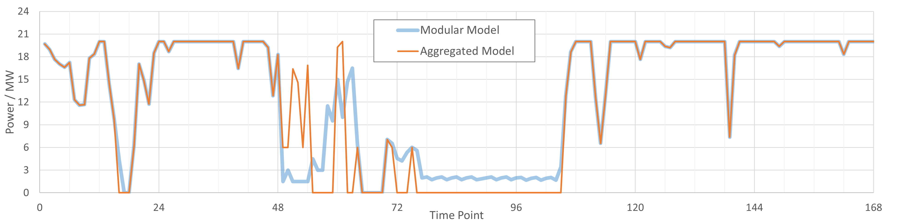
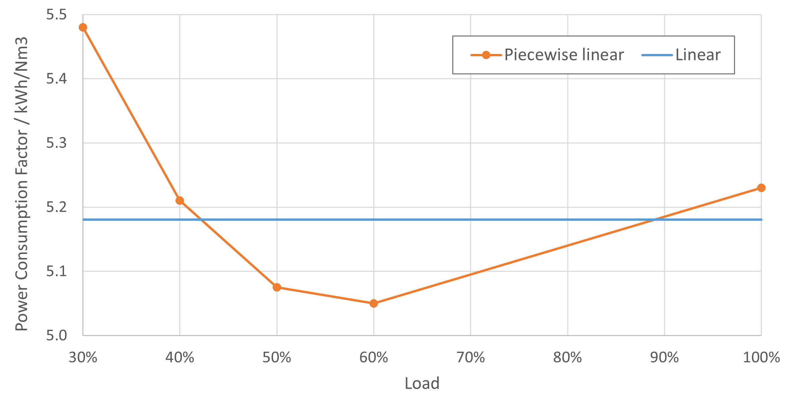
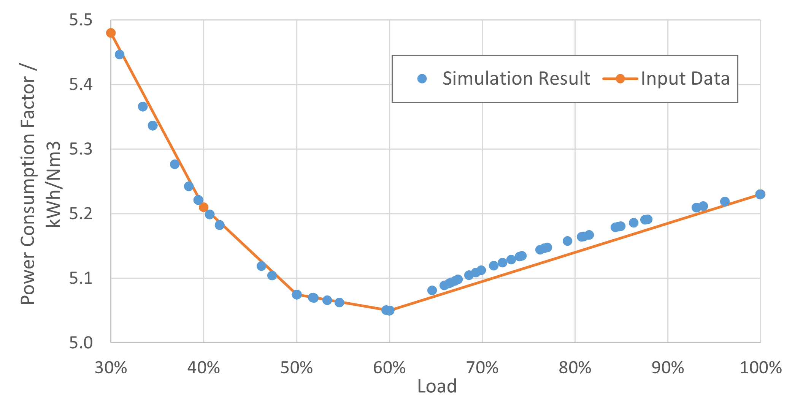
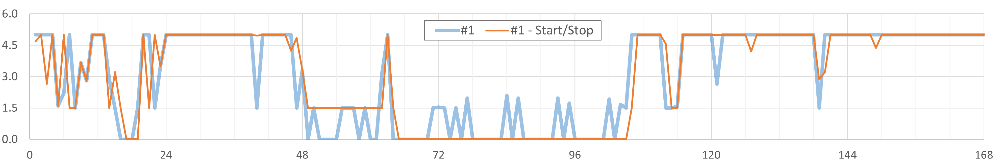
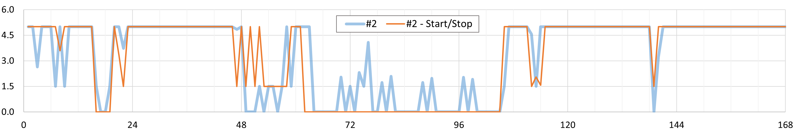
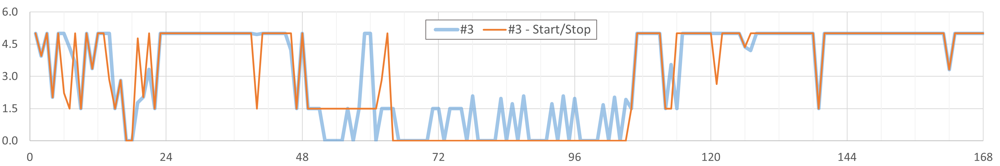
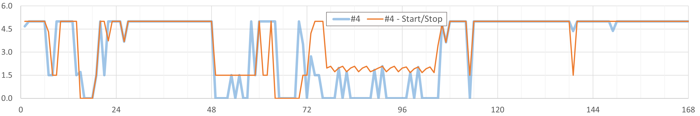

# 能源系统设计：电解槽建模探索


---

电解槽是氢氨醇能源系统的一个关键组件，负责将可再生能源电力转换为绿氢。在能源系统优化设计中，电解槽模型可能影响系统容量配置及调度策略。本文通过数值实验探究电解槽建模的关键参数如电耗系数、启停约束、分组策略等对绿氢生产的影响。

## 问题描述

假设一个简单的能源系统如下图所示，包含45MW风电、25MW光伏、20MW电解槽和储氢罐等主要组件。本文不涉及具体组件的数学建模过程，而是在假定已经具备模型的基础上，以最小化运行成本为目标函数，求解并对比不同电解槽建模方式下的绿氢生产。主要对比项目如下：

- 电解槽整体模型 v.s. 分组模型

- 电解槽线性模型 v.s. 分段线性模型

- 电解槽启停约束 v.s. 无启停约束


``` 
                          │      ┌───────┐      │                 
                          │      │  H2   ◄──────┼                 
            ┌──────┐      │      │ TANK  │      │                 
            │ WIND │      │      │ 32kNm3┼──────►                 
            │ 45MW ┼──────►      └───────┘      │                 
            └──────┘      │                     │                 
                          │                     │       ┌──────┐  
                          │      ┌───────┐      ├───────►  H2  │  
                          │      │  ALK  │      │       └──────┘  
            ┌──────┐      ┼──────►  20MW ┼──────►                 
            │  PV  │      │      │       │      │                 
            │ 25MW ┼──────┤      └───────┘      │                 
            └──────┘      │                     │                 
                          │                     │                 
                          ▼                     ▼                 
                     electricity             hydrogen             
```

数值仿真时间范围为间隔1小时的一周共计24*7=168小时，相应风光出力曲线如下图所示。


## 电解槽整体模型 v.s. 分组模型

假设电解槽单槽参数如下表所示。整体建模表示将20MW电解槽作为一个整体进行优化计算，分组建模则表示将20MW电解槽拆分为4个5MW的单槽。相比分组建模，整体建模明显减少变量数，计算效率高；但是最低工作功率 20x30%=6MW，相比实际单槽的 5x30%=1.5MW 高出很多，不利于弱风弱光场景下（例如风光出力曲线的[72,96]区间）的新能源消纳。

额定功率 | 平均电耗 | 工作区间
:---: | :---: | :---:
5MW | 5.18 kWh/Nm3 | 30%-100%

通过优化计算得到电解槽消纳风光功率的曲线如下图所示。可以看到，弱风弱光区间 [78,102] 内，整体建模的电解槽因为此刻风光功率低于工作区间下限而处于停机状态，而分组模型则可以启动部分电解槽工作。最终，分组模型相比整体模型提升绿氢产量约 3.51%。



**本质上，整体模型等效于假定4个单体电解槽具有完全相同的行为，进而合并为一个虚拟电解槽。因此，通过简化模型提升了计算效率，同时因为简化带来的强约束（单体电解槽行为一致）也导致精度的损失**。

从当前试验来看，3.51% 的差异还算可以接受；此外，此类系统通常配置储能，在储能的调节下，这个差异可以进一步减小。例如，在原系统基础上引入 6MW/12MWh 的储能后，两种建模方式的绿氢产量差异可以减小到0.22%。


综上，实际使用中，**可以视场景需求选择整体模型或分组模型**。


## 电解槽线性模型 v.s. 分段线性模型

上一组试验我们采用的是线性模型，即假设电解槽在任何工作功率下电耗均为 5.18 kWh/Nm3。然而，实际电解槽的电耗通常是非线性的，即不同工作功率对应不同的电耗系数。我们选择有限功率点后进行分段线性化，即可得到分段线性模型，如下图所示。




分段线性模型将引入更多变量，必然影响计算效率，但相比简单线性模型是否更能准确反映电解槽的行为例如最终的产氢量？从电耗曲线图来看，二者确实差异较大。但转换为相应功率点下的单位氢气产量图，如下所示，二者则相当接近。因此，可以推论分段线性模型相比线性模型对最终产氢量的影响应该不大。


接下来看看数值试验结果是否支持这一推论。我们采用分组模型分别建模4台电解槽，然后对比简单线性和分段线性模型的功率消耗（下图）及绿氢产量。结果发现，简单线性模型的绿氢产量增加了 0.67%。也就是说，分段线性模型以较大计算效率损失为代价，仅仅带来了 0.67% 的精度提升。

综上，**使用分段线性模型的意义并不大**。


最后，验证一下分段线性模型的实施效果以及探究为什么简单线性模型的绿氢产量高于分段线性模型。将4个电解槽在所有时刻的电耗计算值分别绘制散点图和频率图，如下所示。

- 从散点图可以看到，分段线性模型在各个功率点的电耗计算值与理论输入值基本一致，验证模型约束正确。

- 从频率图可以看到，输入功率基本集中在 [90%,100%] 区间；结合本节第一张图，此区间内简单线性模型的电耗系数正好小于分段线性模型，因为简单线性模型的制氢量会稍高。




## 电解槽启停约束 v.s. 无启停约束

能源系统优化计算需要兼顾频繁启停电解槽对使用寿命的影响。启停约束一般通过引入启停成本到目标函数来间接实现，相应地，计算时间也会显著增加。

本节基于简单线性、分组电解槽模型，分别施加和不施加启停约束，得到功率消耗结果如下图所示。如果不约束启停，4个电解槽在弱风弱光区间都存在频繁启停的现象；而一旦约束后，1-3号电解槽处于停机状态，仅由4号电解槽进行功率消耗。从最终制氢量来看，施加启停约束导致制氢量略微减小（-0.013%）。

综上，**在更多关注氢气产量例如配置优化的场景下，可以忽略启停约束以提高计算效率；而调度优化场景下，则需要施加启停约束以确保调度合理性**。








