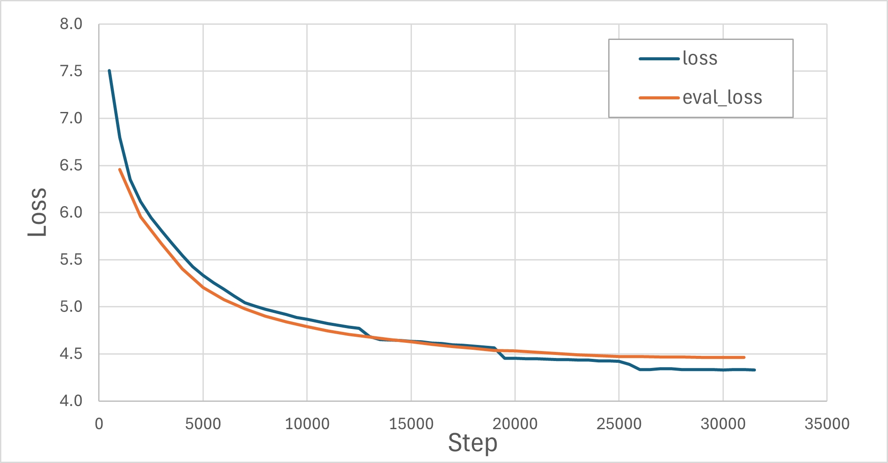

# 基于GPT2的古诗生成器：预训练篇

---


预训练过程相对标准化流水化或者说机械化，网上有很对代码可以参考，包括本文具体代码也是参考自网络。因此，这里不详细展开代码，而是从原理上剖析和理解各个步骤：

- 训练分词器
- 配置模型
- 加载和处理数据
- 配置训练参数和启动训练


## 0. 预训练的本质：语言建模任务

在开始具体训练流程之前，先理解预训练到底在做什么。GPT系列模型使用的是 **因果语言建模**（Causal Language Modeling, CLM），核心思想极其朴素：

> 给定前文，预测下一个 token。

举个例子，给定诗句"落霞与孤鹜齐"，模型需要预测下一个字最可能是"飞"。训练时，我们把整首诗喂给模型，让它逐token地预测：

```
输入:  落  霞  与  孤  鹜  齐
预测:  霞  与  孤  鹜  齐  飞
```

这就是所谓的"自回归" —— 每一步的预测都基于之前所有已生成的 token。

预训练最巧妙的地方在于：**数据自带标签**，因此预训练是"无监督"的。你不需要人工标注，文本本身就是监督信号。

对于一首诗：

```
白日依山尽，黄河入海流。欲穷千里目，更上一层楼。
```

模型自动构造训练样本：

| 输入（前文） | 目标（下一个token） |
|-------------|-------------------|
| 白 | 日 |
| 白日 | 依 |
| 白日依 | 山 |
| ... | ... |
| 白日依山尽，黄河入海流。欲穷千里目，更上一层 | 楼 |

85万首诗，假设每首平均40个字符，总共就有约3400万个训练样本——全部自动生成，无需任何人工标注。因此，大语言模型的预训练数据可以是海量的。


## 1. 分词器：让模型"认识"汉字

现在，我们来到预训练流程的第一步。模型不能直接处理原始文本，需要先将文字转换为数字——这就是分词器（Tokenizer）的工作。

最简单的想法：每个汉字一个ID。但这有几个问题：

- **词表太大**：常用汉字8000+，加上生僻字轻松过万，但很多字出现频率极低，浪费模型容量。
- **丢失语义组合**："明月"作为一个整体比"明"+"月"更有诗意，字级别分词无法捕捉这种搭配。
- **序列变长**：同样一句话，字级别token数远多于子词级别，增加计算量。

BPE（Byte Pair Encoding）是一种**子词分词**算法，核心思想是：从字符开始，反复合并最高频的相邻符号对。

```
初始: 每首诗被拆成单个字符
第1轮: "明"+"月" → "明月" （出现10万次，最高频）
第2轮: "清"+"风" → "清风" （出现8万次）
第3轮: "江"+"山" → "江山"
...
第N轮: 直到词表达到设定大小
```

这样，"明月几时有"可能被切分为 `["明月", "几", "时", "有"]`，既保留了高频搭配，又能用有限的词表覆盖所有文本。

### 自定义分词器的训练过程

本项目使用HuggingFace的 `tokenizers` 库训练BPE分词器，代码见 [train_tokenizer.py](https://github.com/dothinking/llm_learning/blob/main/pre_training/train_tokenizer.py)。

**第一步：语料准备**

从 `poetry.csv` 中提取所有诗的正文，每首末尾添加 `<EOS>` 标记，写入纯文本文件：

```python
for row in reader:
    content = row.get("content", "").strip()
    if content:
        f_out.write(f"{content}<EOS>\n")
```

**第二步：训练分词器**

```python
tokenizer = ByteLevelBPETokenizer()

tokenizer.train(
    files=[filename],
    vocab_size=20000,       # 词表大小
    min_frequency=10,       # 最少出现10次才收录
    special_tokens=[
        "<s>", "<pad>", "</s>", "<unk>", "<mask>", "<EOS>"
    ]
)
```

关键参数说明：

| 参数 | 值 | 说明 |
|------|-----|------|
| `vocab_size` | 20000 | 小模型建议10k-32k，2万对古诗场景足够 |
| `min_frequency` | 10 | 过滤掉只出现个位数的罕见字/组合，减少噪声 |
| `special_tokens` | 6个 | `<EOS>` 标记诗句结束，`<pad>` 用于批次填充，`<unk>` 处理未知字符 |

**第三步：加载与验证**

训练完成后，用 `GPT2TokenizerFast` 加载并添加特殊token：

```python
tokenizer = GPT2TokenizerFast.from_pretrained('tokenizer')
tokenizer.add_special_tokens({
    "eos_token": "<EOS>",
    "additional_special_tokens": ["<EOS>"]
})
tokenizer.pad_token = tokenizer.eos_token  # 用EOS作为padding
```

### 分词效果演示

用测试脚本 [test_tokenizer.py](https://github.com/dothinking/llm_learning/blob/main/pre_training/test_tokenizer.py) 看看实际效果：

```
原始文本: 汉陵今日无抔土，惟独先生有钓台。<EOS>
Token IDs: [796, 920, 1150, 309, 10628, 1188, 264, 912, 546, 1722, 330, 7649, 262, 20001]
decoded: 汉陵今日无抔土，惟独先生有钓台。<EOS>
切分词块: ['汉', '陵', '今日', '无', '抔', '土', '，', '惟', '独', '先生', '有', '钓台', '。', '<EOS>']
```

可以看到，BPE分词器将诗句切分为有意义的子词单元。高频词如“今日”、“先生”、“钓台”被保留为整体，标点符号和 `<EOS>` 也被正确识别。最终词表大小为 **20001**（20000个BPE token + 1个额外特殊 token）。


## 2. 模型架构：搭一个迷你 GPT2

有了分词器，接下来搭建模型。本项目不从头实现Transformer，而是使用HuggingFace的 `GPT2Config` 配置一个迷你版 GPT2。

### GPT2Config参数详解

```python
config = GPT2Config(
    vocab_size=len(tokenizer),      # 20001
    hidden_size=768,                # 隐藏层维度
    num_hidden_layers=8,            # Transformer层数
    num_attention_heads=12,         # 注意力头数
    max_position_embeddings=256     # 最大序列长度
)
model = GPT2LMHeadModel(config)
```

| 参数 | 本项目 | 标准GPT2-small | 说明 |
|------|--------|---------------|------|
| `vocab_size` | 20001 | 50257 | 匹配自定义分词器 |
| `hidden_size` | 768 | 768 | 与标准一致 |
| `num_hidden_layers` | 8 | 12 | 减少4层，降低参数量 |
| `num_attention_heads` | 12 | 12 | 与标准一致，每头64维 |
| `max_position_embeddings` | 256 | 1024 | 一首诗+指令足够 |


### 72M 参数是怎么算出来的

对比标准GPT2-small的124M参数量，本项目迷你GPT2模型参数约为 72.26M，主要分布在词嵌入和解码器部分。

- **Token Embedding（词嵌入）**

    ```
    vocab_size × hidden_size = 20001 × 768 ≈ 15.36M
    ```

- **Position Embedding（位置嵌入）**

    ```
    max_position × hidden_size = 256 × 768 ≈ 0.20M
    ```

- **Decoding Block（解码器块）**

    每个 Block 约 **7.1M**，8层共约 **56.8M**：

    ```
    # Q、K、V 投影各 768×768，输出投影 768×768
    Multi-Head Self-Attention：4×768×768 ≈ 2.36M

    # 两层全连接 768→3072 和 3072→768
    Feed-Forward Network：2×768×3072 ≈ 4.72M

    # 两个层归一化，每个 `2×768`
    LayerNorm：2x2×768 ≈ 3K
    ```

- **LM Head（输出头）**

    ```
    hidden_size × vocab_size = 768 × 20001 ≈ 15.36M
    ```

    > 实际上GPT2中LM Head与Token Embedding **共享权重**（weight tying），所以不重复计算。
    
**总计**：15.36M + 0.20M + 56.8M ≈ **72.36M**


**关于共享权重的展开**：

共享权重可以直接减少参数量，数学意义上也是合理和自然的。Token Embedding 将每个 token 转换为高维表示（例如本文的768），注意力层的输出也是768维的向量，最后 LM Head 需要通过权重矩阵将这个高维向量转换回词表输出，对应下一个 token 的预测值。那么直接从 Token Embedding 中找最接近的向量（夹角最小、点积最大）是不是很合理？这不正是 LM Head 的操作嘛 -> 注意力层输出矩阵乘以 **权重矩阵** 再 softmax。所以让权重矩阵等于 Token Embedding 矩阵是不是很合理？好吧，有点跑题了。


## 3. 数据加载与处理

一个标准的训练流程是构造 `transformers.Trainer` 实例，然后调用 `trainer.train()` 开始训练。我们看一下 Trainer 的关键参数：`model`上一节讲完了，`args`是下一节要讲的训练参数，本节介绍数据集 `train_dataset`、`eval_dataset` 和数据加载器 `data_collator`。


```python
train_dataset, eval_dataset = load_tokenized_dataset()

trainer = Trainer(
    model=model,
    args=training_args,
    data_collator=DataCollatorForLanguageModeling(tokenizer=tokenizer, mlm=False),
    train_dataset=train_dataset,
    eval_dataset=eval_dataset,
    callbacks=[VisualProgressCallback()]
)

trainer.train()
```

### 数据加载流程

标准函数 `datasets.load_dataset` 直接加载CSV文件，然后 `map` 方法依次将每个样本处理为最终需要的格式，这为初始数据集的准备保留了一定的自由度。

```python
def load_tokenized_dataset():
    def tokenize_function(examples):
        texts = [f"{text}<EOS>" for text in examples["content"]]
        return tokenizer(texts, truncation=True, max_length=256)

    raw_dataset = load_dataset("csv", data_files='./dataset/poetry.csv', split="train")
    tokenized = raw_dataset.map(tokenize_function, batched=True, num_proc=4,
                                 remove_columns=raw_dataset.column_names)
    split_dataset = tokenized.train_test_split(test_size=0.05, seed=42)
    return split_dataset["train"], split_dataset["test"]
```

关键细节：
- 每首诗末尾追加 `<EOS>`，让模型学会何时"收尾"
- `truncation=True, max_length=256`：超过256个token的诗会被截断
- `num_proc=4`：4进程并行处理，加速tokenize
- `train_test_split(test_size=0.05)`：95%训练 / 5%验证

最终数据量：**训练集 810,715 条，验证集 42,670 条**。


### DataCollatorForLanguageModeling 的工作原理

HuggingFace提供了 `DataCollatorForLanguageModeling`，它进一步处理原始数据集为大模型训练所需的格式。具体地，它自动完成两件事：

**（1）自动右移构造 labels**

对于 CLM 任务，labels 就是 input_ids 右移一位。这就是开头提到因果语言模型预测下一个 token 的基本任务。

```python
# 原始文本: "白日依山尽<EOS>"
input_ids = [白, 日, 依, 山, 尽, <EOS>]
labels    = [日, 依, 山, 尽, <EOS>, -100]  # 最后一个位置没有目标，设为-100
```

`DataCollatorForLanguageModeling` 在内部自动完成这个移位操作，设置 `mlm=False` 表示使用 CLM 模式而非 MLM 模式。

> CLM 是本文开头提到的因果语言模型，MLM 是掩码语言模型（Masked Language Modeling）。

**2. Padding 与 Attention Mask**

同一批次中的诗句长度不同，需要padding到统一长度：

```python
# batch中两条数据，长度不同
"白日依山尽<EOS>"          → [白, 日, 依, 山, 尽, <EOS>]          # 6个token
"白日放歌须纵酒<EOS>"      → [白, 日, 放, 歌, 须, 纵, 酒, <EOS>]   # 8个token

# padding后（以批次中最长的序列为准，统一补到8）
input_ids:      [[白, 日, 依, 山, 尽, <EOS>, <PAD>, <PAD>],
                 [白, 日, 放, 歌, 须, 纵,   酒,   <EOS>]]
attention_mask: [[1,  1,  1,  1,  1,  1,     0,     0   ],
                 [1,  1,  1,  1,  1,  1,     1,     1   ]]
```

`attention_mask` 标记哪些位置是真实token（1），哪些是padding（0），确保模型不会在padding上浪费注意力。


## 4. 训练配置与超参数

关键超参数及其说明如下。

```python
training_args = TrainingArguments(
    output_dir="checkpoints",
    num_train_epochs=5,
    per_device_train_batch_size=128,
    save_steps=500,
    save_total_limit=4,
    logging_steps=500,
    learning_rate=3e-4,
    warmup_steps=1000,
    lr_scheduler_type="cosine",
    weight_decay=0.01,
    bf16=True,
    fp16=False,
    eval_strategy="steps",
    eval_steps=1000,
    save_strategy="steps",
)
```

| 参数 | 值 | 说明 |
|------|-----|------|
| `num_train_epochs` | 5 | 85万条数据，5轮足够收敛 |
| `per_device_train_batch_size` | 128 | 64GB显存可以开大batch，加速训练 |
| `learning_rate` | 3e-4 | 小模型的标准学习率，GPT2论文使用2.5e-4~5e-4 |
| `warmup_steps` | 1000 | 前1000步线性增长学习率，避免初期梯度不稳定 |
| `lr_scheduler_type` | cosine | 余弦退火，训练后期平滑降低学习率 |
| `weight_decay` | 0.01 | L2正则化，轻微防止过拟合 |
| `bf16` | True | BF16混合精度，节省显存且数值稳定性好 |
| `eval_steps` | 1000 | 每1000步在验证集上评估 |
| `save_steps` | 500 | 每500步保存checkpoint |


为了直观感受训练进展，实现了一个回调函数 `VisualProgressCallback`，每500步用固定提示词“落霞与孤鹜齐飞”试运行。这个回调让我们在训练过程中就能看到模型“写诗”能力的进化，比盯着loss数字直观得多。

```python
class VisualProgressCallback(TrainerCallback):
    def on_log(self, args, state, control, model=None, **kwargs):
        if state.global_step > 0:
            prompt = "落霞与孤鹜齐飞"
            inputs = tokenizer(prompt, return_tensors="pt").to(model.device)
            model.eval()
            with torch.no_grad():
                outputs = model.generate(
                    **inputs,
                    max_new_tokens=100,
                    do_sample=True,
                    top_k=50, top_p=0.95, temperature=0.8,
                    pad_token_id=tokenizer.eos_token_id
                )
            model.train()
            decoded_text = tokenizer.decode(outputs[0], skip_special_tokens=True)
            print(f"生成的文本内容：\n{decoded_text}")
```


## 5. 训练过程实录

训练在64GB显存的异构加速卡上运行，总耗时约 **5.3小时**（18930秒），共 **31,670步**。Loss从7.5降到4.33，验证集loss从6.46降到4.46，两者差距始终很小，说明没有明显过拟合。



各阶段的生成效果变化:

**第500步：完全乱码**

> 落霞与孤鹜齐飞，一自得与有下。朝无相作来，为此此有出一。从无非成作，为不一以非。不以生不如，不道于。无非生，不。为如其，君。一所，如不自。愿，三无。我，以其。神，无言。为，方，以于。其，我。如，心，我，与。两，不与

模型还处于"牙牙学语"阶段，输出的"诗句"毫无意义，只是随机token的堆砌。

**第2000步：开始有诗词的外形**

> 落霞与孤鹜齐飞，风静泠泠木叶飞。自是山僧生夜坐，一歌明月是青山。老游一友同吟处，却把红尘又倚楼。惟有扁舟有明月，人间何处有人间。一篇不问花如海，小鹤都从鹤外船。只恨故人无有子，不知无子便蹉跎。故人多病如回首，万里江南正白头。千里青山已若何，悠悠风雨有相思。天涯往事须千里，江上青山一惘然

虽然意象跳跃、逻辑松散，但已经出现了"明月"、"青山"、"天涯"等诗词常见意象，五言和七言的节奏感也开始显现。

**第20000步：开始有诗词的神态**

> 落霞与孤鹜齐飞，落日西风下翠微。渡口晚潮犹未落，沙边寒雁正思归。百年世事随流水，万里乡心趁落晖。赖有故人相慰藉，一樽重酌细论诗。百年事业共悠悠，回首西风念旧游。天上麒麟开御座，人间鹦鹉羡江楼。青山落日双飞鸟，落日西风一旅愁。回首不堪回首处，不胜愁思上扁舟。秋净寒江百尺矶，渚宫斜日暮云低。数声过雁天边去，万里归鸿天际归。

不仅逐渐学到了押韵（"飞"、"微"、"归"、"晖"）和对仗（"百年世事随流水，万里乡心趁落晖"），意象也更加丰富且协调（"落日"、"晚潮"、"归雁"、"百年世事"、"万里乡心"）；前八句也能隐约感受律诗的起承转合。


## 6. 小结：预训练教会了模型什么

经过5.3小时、31670步的训练，模型从随机权重变成了一个"会写诗"的神经网络。它学到了：

- **诗词的韵律感**：五言、七言的节奏，押韵、对仗的倾向。
- **常见意象搭配**："明月"配"清风"，"扁舟"配"江湖"，"青山"配"绿水"。
- **基本的语法结构**：主谓宾的排列，虚词的使用。
- **收尾能力**：`<EOS>` 标记让模型知道何时该停。

但它还不会理解指令，例如按主题、体裁、风格等控制内容。这些能力需要下一篇的 **监督微调（SFT）** 来赋予：我们将构造4.9万条指令-回答对，用Completion-Only掩码技巧让模型只学习"回答"部分，在7.7分钟内让模型从"诗句接龙"进化为"按需创作"。

---

**本文完整代码参考**：

https://github.com/dothinking/llm_learning/tree/main/pre_training

**GPT背景知识**：

- [GPT-2模型家族（小/中/大/XL）选型指南：124M到1.5B参数全解析](https://blog.csdn.net/gitblog_02015/article/details/149626493)

- [GPT2参数量剖析](https://zhuanlan.zhihu.com/p/640501114)

- [GPT3原理讲解](https://zhuanlan.zhihu.com/p/642745932)