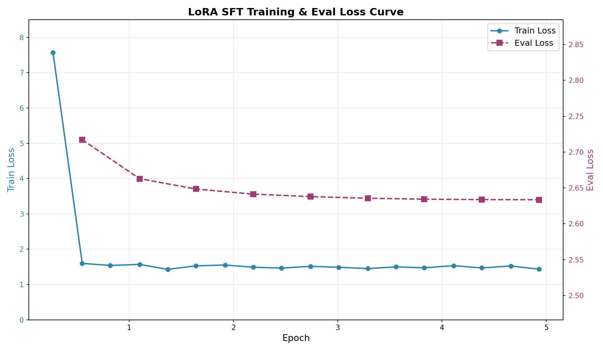

# 基于GPT2的古诗生成器：LoRA篇

---


在上一篇中，我们用全量SFT成功让模型学会了指令遵循。但全量微调（更新全部72M参数）存在存储成本、过拟合风险、灾难性遗忘这三个不容忽视的问题。这就引出了 **参数高效微调**（Parameter-Efficient Fine-Tuning, PEFT）的理念：冻结预训练模型的大部分参数，只训练一小部分新增参数，就能达到接近全量微调的效果。

本篇从低秩分解的数学原理开始，到PEFT库的实战配置，再到与全量SFT的效果对比，完整呈现 LoRA "四两拨千斤"的高效微调方案。

本文可以配合此处 [源码](https://github.com/dothinking/llm_learning/tree/main/lora) 阅读和理解。


## 0. LoRA 原理

LoRA（Low-Rank Adaptation）由微软在2021年提出：预训练模型已经包含了丰富的知识，当我们对模型做微调时，权重的变化量 ΔW 不需要是一个满秩的大矩阵——它可以用两个小矩阵的乘积来近似。

换句话说，模型适配新任务所需的"知识增量"是**低秩**的，可以用很少的参数来表达。


LoRA的核心公式极其简洁：

$$
W' = W + \Delta W = W + \frac{\alpha}{r} \cdot BA
$$

其中：

- **W**：原始预训练权重（冻结，不更新）
- **ΔW**：微调带来的权重变化
- **B**：维度为 `[d_out, r]` 的可训练矩阵
- **A**：维度为 `[r, d_in]` 的可训练矩阵
- **r**：秩（rank），远小于 d_in 和 d_out
- **α**：缩放因子，控制LoRA更新的幅度

例如，如果 W 是 768×768 的矩阵（约59万参数），直接训练 ΔW 需要59万个参数。但用LoRA，B 是 768×16，A 是 16×768，总共只需 768×16×2 = **24,576** 个参数——仅为原来的 **4%**。

下图展示了 LoRA 的传播过程：前向传播时，输入 x 同时经过原始权重 W（冻结）和 LoRA 旁路 B·A，两个分支的输出相加，得到最终结果；反向传播时，梯度只流过 B 和 A，W 保持不变。


```
输入 x ──────┬────→ W (冻结) ──────────────┬────→ 输出 h = W·x + (α/r)·B·A·x
             │                            │
             └────→ A (r×d_in, 可训练)     │
                       ↓                   │
                    B (d_out×r, 可训练) ────┘
```


## 1. 本项目的LoRA配置


```python
lora_config = LoraConfig(
    task_type=TaskType.CAUSAL_LM,
    r=16,                                    # 秩16
    lora_alpha=32,                           # 缩放因子32
    lora_dropout=0.05,                       # 轻微dropout
    target_modules=["c_attn", "c_proj", "c_fc"],  # 覆盖全部线性层
    use_rslora=True                          # 使用rsLoRA
)
```

| 参数 | 值 | 说明 |
|------|-----|---------|
| `r=16` | 秩 16 | 经典配置，在表达能力与参数量间取得平衡。r=8 可能表达不足，r=32 参数翻倍但收益递减 |
| `alpha=32` | 缩放因子 32 | alpha=2r 是经典配置，保证LoRA输出的有效幅度 |
| `target_modules` | `c_attn`, `c_proj`, `c_fc` | 覆盖GPT-2全部线性层：注意力投影 + 输出投影 + MLP中间层，确保指令理解与生成全链路适配 |
| `use_rslora=True` | rsLoRA | 将缩放从 `alpha/r` 改为 `alpha/√r`，避免高秩下LoRA输出被过度缩放导致训练不稳定 |
| `dropout=0.05` | 轻微 dropout | 4.9万条数据规模适中，仅需轻微正则化，防止LoRA适配器过拟合 |


应用LoRA后，模型打印出：

```
trainable params: 1,572,864 || all params: 73,834,752 || trainable%: 2.1302
```

- **可训练参数**：约 **157万**（仅LoRA适配器的 B 和 A 矩阵）
- **总参数**：约 **7383万**（基座模型7226万 + LoRA适配器157万）
- **可训练比例**：**2.13%**

这意味着：
- 反向传播时，只有2.13%的参数需要计算梯度
- 优化器状态（AdamW的动量和方差）也只维护这2.13%的参数
- 显存占用大幅降低

与全量SFT的参数对比

| 维度 | 全量SFT | LoRA SFT |
|------|---------|----------|
| 可训练参数 | 72,261,888 (100%) | 1,572,864 (2.13%) |
| 单模型存储 | ~300MB | ~6MB（仅适配器） |
| N个任务的存储 | N × 300MB | 300MB + N × 6MB |
| 过拟合风险 | 较高 | 较低 |
| 灾难性遗忘风险 | 存在 | 极低（基座权重冻结） |
| 训练速度 | 基准 | 略快（梯度计算量减少） |


## 2. 训练实现与效果


HuggingFace 的 `PEFT` 库让 LoRA 的使用只需三行代码：

```python
from peft import LoraConfig, get_peft_model, TaskType

lora_config = LoraConfig(...)                # 1. 定义LoRA配置
model = get_peft_model(model, lora_config)   # 2. 将LoRA注入模型
model.print_trainable_parameters()           # 3. 查看可训练参数
```

`get_peft_model` 会自动遍历模型的所有层，在 `target_modules` 指定的层中插入LoRA适配器，并冻结原始权重。


LoRA训练使用与全量SFT完全相同的数据集，数据格式和预处理逻辑也完全一致：

```python
def format_sft(examples):
    texts = []
    for ins, answer in zip(examples["instruction"], examples["answer"]):
        text = f"{ins}\n输出：{answer}"
        texts.append(text)
    return tokenizer(texts, truncation=True, max_length=256)
```


训练配置参数如下：

```python
training_args = TrainingArguments(
    output_dir="checkpoints",
    num_train_epochs=5,                    # 比SFT多2轮
    per_device_train_batch_size=32,
    gradient_accumulation_steps=4,
    learning_rate=5e-5,                    # 比SFT略高
    warmup_ratio=0.05,                     # 新增：warmup
    lr_scheduler_type="cosine",            # 新增：余弦退火
    weight_decay=0.01,
    eval_strategy="steps",                 # 新增：验证
    eval_steps=200,
    save_strategy="steps",
    load_best_model_at_end=True,           # 新增：加载最佳模型
    metric_for_best_model="eval_loss",
    greater_is_better=False,
)
```

与全量SFT的关键差异：

| 配置项 | 全量SFT | LoRA SFT | 原因 |
|--------|---------|----------|------|
| 学习率 | 3e-5 | 5e-5 | LoRA只训练少量参数，需要稍大的学习率来有效更新 |
| Epoch | 3 | 5 | LoRA参数少，需要更多轮次充分训练；且过拟合风险低 |
| LR Schedule | 线性衰减 | Cosine + Warmup | LoRA训练更稳定，可以用更精细的调度策略 |


训练过程的主要参数及损失曲线如下所示。

- **总步数**：约1,825步（5 epochs × 46,793 train samples / 128 effective batch size）
- **训练耗时**：约752秒（**12.5分钟**）
- **训练速度**：约2.4步/秒




关键观察：

- **Train Loss**：从 7.569 → 1.433，下降约 **81%**
- **Eval Loss**：从 2.717 → 2.633，**持续下降，无明显过拟合**
- 验证集loss在整个训练过程中稳步下降，说明LoRA的低参数量天然起到了正则化作用


最后看一下效果，新学习的指令遵循正确，预训练具备的诗词能力也保持得很好。

```
输入：写一首边疆战争的诗
输出：
旌旗猎猎动边城，杀气凭陵塞月晴。
瀚海风高连雁落，沙场霜重带弓鸣。
营前白草秋无际，帐底黄云晓有声。
闻道将军征戍急，捷书何日下承明。
```


### 为什么LoRA在本例中没有训练时间优势？

一个值得注意的细节：

- LoRA的训练1825步共计12.5分钟，平均2.4步/秒，
- 参考前文，全量SFT训练1155步总耗时7.7分钟，平均2.5步/秒

本例中，LoRA因为训练轮数高于SFT导致总耗时更长，其平均每步的效率确实略微高于SFT。即便如此，这似乎与"LoRA更高效"的普遍认知矛盾！根本原因是：

**本例 GPT2-Small（72M）太小了，不足以体现LoRA的速度优势。**

LoRA的"省时"逻辑建立在两个前提上：

1. **梯度计算量减少**：只更新2%的参数，反向传播时梯度计算量大幅下降
2. **优化器状态减少**：AdamW的动量和方差只维护2%的参数，显存和IO开销降低

但这两个优势有一个**隐藏前提**：基座模型的前向传播计算量必须远大于LoRA旁路的额外开销。

对于72M的GPT2-Small：

- 全量SFT：前向传播计算 W·x，反向传播更新全部 W
- LoRA SFT：前向传播计算 W·x + B·A·x，反向传播只更新 B 和 A

LoRA旁路的 B·A·x 是一次**额外的矩阵乘法**。当 W 本身很小时（GPT2的隐藏维度仅768），这个额外开销相对于整体计算量不可忽略。再加上本例中LoRA跑了5个epoch（全量SFT仅3个），总耗时自然更长。


只有当模型越大，W 的前向/反向计算量占比越高，LoRA旁路的相对开销越低，速度优势才越明显。对于72M的小模型，LoRA的真正价值不在于训练速度，而在于：

- **存储效率**：6MB vs 300MB，多任务场景优势巨大
- **防灾难性遗忘**：基座权重冻结，预训练知识完整保留
- **防过拟合**：低参数量天然正则化


## 3. 推理：LoRA模型的加载与合并


LoRA模型的推理需要两步加载：

```python
from peft import PeftModel

# 第一步：加载基座模型
model = GPT2LMHeadModel.from_pretrained("../pre_training/final_model/")

# 第二步：加载LoRA权重
model = PeftModel.from_pretrained(model, "./final_model")
```

`PeftModel.from_pretrained` 会读取 `adapter_config.json` 中的LoRA配置，加载 `adapter_model.safetensors` 中的LoRA权重，并将其注入到基座模型中。


加载LoRA权重后，模型实际上是在运行时动态计算 `W·x + (α/√r)·B·A·x`。虽然正确，但每次前向传播都要做额外的矩阵乘法。`merge_and_unload()` 将LoRA权重**物理合并**到基座模型中：

```python
model = model.merge_and_unload()
```

合并后，`W' = W + (α/√r)·B·A` 被计算并存储为新的权重。此后的推理与普通模型完全一致，没有任何额外计算开销。


合并后的模型就是一个标准的 `GPT2LMHeadModel`，使用方式与全量SFT模型完全相同：

```python
prompt = f"{user_input}\n输出："
inputs = tokenizer(prompt, return_tensors="pt").to(model.device)

outputs = model.generate(
    **inputs,
    max_new_tokens=100,
    do_sample=True,
    top_p=0.9,
    temperature=0.7,
    repetition_penalty=1.2,
)

full_result = tokenizer.decode(outputs[0], skip_special_tokens=True)
answer = full_result.split("输出：")[-1].strip()
```


## 4. LoRA微调框架选型

本文为了保持和预训练及全量微调阶段一致的技术栈，继续沿用PEFT + Transformers框架进行LoRA微调。在实际项目中，根据具体需求和资源，可以选择合适的微调框架。

以下是主流框架的对比：


| 维度 | LLaMA-Factory | Unsloth | Hugging Face Transformers | Axolotl | DeepSpeed | SWIFT |
|------|---------------|---------|---------------------------|---------|-----------|-------|
| 核心理念 | 一站式、零代码微调平台 | 极致的训练速度与显存优化 | 全面的模型生态与训练研发底座 | 配置即代码，追求可复现的生产级工作流 | 大模型分布式训练的超级引擎 | 聚焦中文场景，开箱即用的全流程平台 |
| 核心优势 | 易用性极佳，提供可视化WebUI；模型支持广泛（100+）；集成多种前沿算法 | 技术性能领先，微调速度提升2-5倍，显存占用最高降低80%；支持多GPU训练 | 生态最丰富，数万预训练模型；PEFT、TRL等高灵活性工具库 | 配置管理统一，支持Flash Attention、DeepSpeed ZeRO开箱即用 | 解决超大模型分布式训练瓶颈，ZeRO-3支持万亿参数模型 | 中文场景深度优化；支持魔搭社区海量模型与数据集 |
| 技术门槛 | 低 | 中低 | 中高 | 中 | 高 | 中低 |
| 硬件要求 | 低至中（单张12GB显存） | 极低 | 中至高 | 中至高 | 极高 | 中低 |
| 适用场景 | 快速验证、入门教学、产品MVP开发 | 资源有限时提升效率、个人研究者 | 研究探索、精细控制、复杂多阶段训练 | 生产稳定工作流、团队协作、可复现实验 | 超大规模模型微调（>70B）、企业级分布式训练平台 | 中文开发者、魔搭社区内完成模型开发全流程 |

总的来说，选择微调框架的关键在于平衡易用性、硬件成本、掌控力和规模。

- 如果优先考虑快速上手和低资源门槛，选择 LLaMA-Factory 或 Unsloth。

- 如果需要最大化灵活性和深度定制，Hugging Face Transformers 生态是不二之选。

- 如果目标是建立稳定、可复现的生产级流程，Axolotl 的标准化工作流优势明显。

- 如果需挑战超大规模模型的分布式训练极限，则应投入精力学习 DeepSpeed 甚至 Megatron-LM。


## 5. 小结

本文基于预训练阶段的 GPT-2 诗词基座模型，使用 LoRA 进行指令微调，使模型具备按指令创作诗词的能力。

这背后是 LoRA 通过低秩分解的数学原理，将微调参数量从全量的7200万降至仅157万（2.13%），极大降低了存储成本和过拟合风险。训练过程中，LoRA模型的训练损失和验证损失均稳步下降，最终生成的诗词符合指令要求，且保持了预训练的诗词创作能力。
